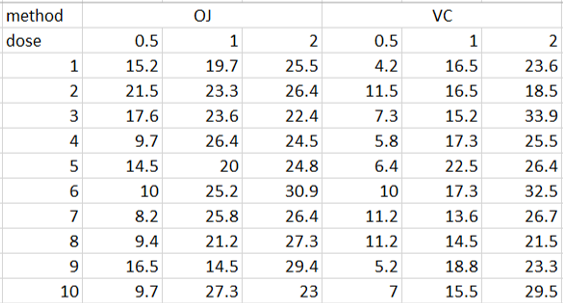
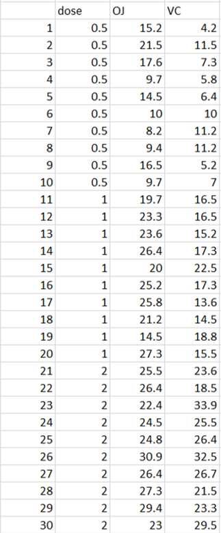
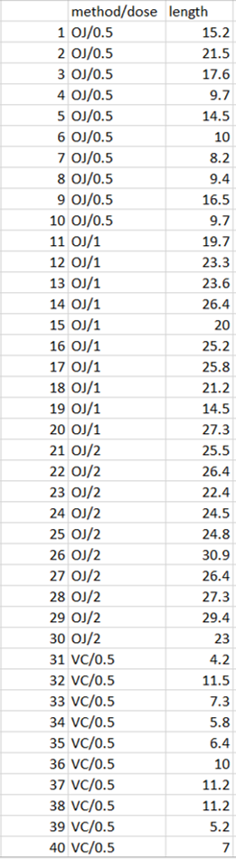
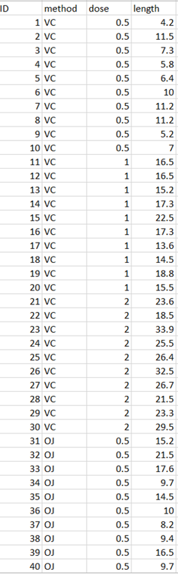

# Class 1

# Organising and naming your data

## Files and folders (directories)

In your interactions with a computer almost everything you do and want to keep is saved into **files**, and files are sitting in **folders (directories)** which may sit inside other directories. The entire system may have an arbitrary depth, so it's easy to be organised, but it's also easy to get lost. Therefore, it's of crucial importance to follow several simple rules when creating your files and folders.

Below you see a directory tree showing an example organisation of Mary's MSc work in a hierarchical directory tree containing the files related to the MSc thesis.

> ```bash
>    / (root) C:
>    └── users
>         ├── Anne
>         ├── Mary
>         │    ├── movies
>         │    ├── music
>         │    └── MSc_thesis
>         │          ├── main_text
>         │          │      ├── outline.docx
>         │          │      └── MSc_thesis.docx
>         │          ├── data
>         │          │      ├── samples.txt
>         │          │      └── localities.txt
>         │          ├── analyses
>         │          │      ├── Diversity_analysis.xlsx
>         │          │      └── Models_and_plots.R
>         │          └── presentations
>         │                 ├── MSc_thesis_progress_report1.pptx
>         │                 └── MSc_thesis_defence.pptx
>         │    
>         ├── John
>         │   ...
> ```

Please note several features that may be helpful during your own work:

- the folder `MSc_thesis` contains several other folders, each with a particular category of information
- the names of the folders at the same time short and informative
- the names of the files are longer (but not very long), and the `_` (underscore) is used extensively
- there are no blanks (spaces) in the names
- files have an extension after the dot (`.`)

### Naming conventions

In modern computers, when it comes to naming things, almost everything is allowed. However, this doesn't mean that everything that is allowed makes sense. Actually, you may easily get into trouble (of the worst, unpredictable, kind) when naming things freely.
Therefore, it's best to stick to the following conventions:

> #### Naming dos and don'ts
> 
> - try to make the names short but informative
> - **use** only letters (a-z, A-Z), digits (0-9), underscore (`_`), and dash (`-`)
> - **avoid** dot (`.`) in folder names
> - **use sparingly** dot (`.`) in file names, mainly to separate the extension indicating the file type from the rest of the name
> - **NEVER** use special characters (`#$%&*`) etc. in folder or file names
> - **NEVER** use language specific letters with accents (`śźąłó`) etc. in folder or file names
> - **NEVER** use blanks/spaces in folder or file names (as you may have noticed, this is not even followed by default by operating systems, like Windows, but we'll argue that avoiding blanks in the names is a very good practice - you can't go wrong with that)
> 
> There  could be also more specific recommendations regarding the actual naming of files and folders, but there's not broad consensus here and we rather appeal to the common sense.

> #### Naming examples - Bad
> 
> `Mój ulubiony folder` - spaces and nonstandard character (`ó`) , the name is not really informative
> `Asia123` - not informative
> `John and Mary's wedding list of guest including the project of the honeymoon trip and the list of presents.docx` - spaces, special character (`'`), very long name
> `My.Measurements.csv` - not informative, two dots are confusing
> `stuff from James` - spaces, not informative

> #### Naming examples - Good
> 
> `MSc_thesis`
> `Triturus_localities_2020.txt`
> `Fat_content_measurements_May_2020.txt`
> `MSc_Thesis_comments_WB_PZ_TG` in this example the file contains comments by several people, the order they saw and commented the thesis indicated by the order of their initials. This is one of the possible conventions.
> `Chapter1.md` whether this is an acceptable name depends on the context - the name in itself is not particularly informative, but if it sits in an appropriate folder (e. g., `Mary/MSc_thesis`) it's acceptable. On the other hand it looses its informativeness when moved out of its folder, so it's better to make the file names a bit more informative.

## Data organisation

Biological data come in a bewildering variety of types and formats, they may be microscopic images, movies, sound recordings, crystallographic data, measurements from various kinds of specialised instruments, DNA and protein sequences, chromatography profiles. There are, however, some universal, or at least widely applicable rules that allow a sensible and efficient organisation of the data. In this section we'll present these rules and illustrate them with examples of correctly an incorrectly organised data.

### The two rules of data organisation

1. Each piece of the information should be stored only in one place, so that, if needed, it has to be modified only once.

2. In the vast majority of cases the data represent some measurements of various performed on **objects** or **cases** (human subjects, individuals, soil samples etc.), some characteristics or properties of these objects. Then, the natural organisation of data is:
   
   - objects/cases are in rows
   
   - characteristics/measurements/properties are in columns

These two rules are by no means obvious and we usually need some practice to internalise them and put them to good use. Below you'll find more explanations, examples and exercises. Let's start by introducing two training datasets.

> ### Training datasets
> 
> #### Dataset 1 - Teeth
> 
> A total of 60 guinea pigs were used in the following experiment. Each animal received one of three dose levels of vitamin C (0.5, 1, and 2 mg/day) by one of two delivery methods, orange juice (OJ) or ascorbic acid (VC). The response is the length (in μm) of odontoblasts (cells responsible for tooth growth) measured at the end of the experiment.

> #### Dataset 2 - Newts
> 
>  Tissue samples were collected from many individuals of several species of newts inhabiting many different ponds. For each individual its species, sex, length and weight were recorded, for some also a blood sample was collected. DNA was extracted from these samples (in some cases more than one extraction is available for an individual) and DNA concentration was measured. So, what we have physically in the laboratory are tubes, one or more per individual, containing extracted DNA at known concentration. 

### Getting your data right

#### Teeth dataset

Our data consist of tooth length measurements for 60 guinea pigs, with each of the animals assigned to a delivery method (OJ, VC) and a particular dose (0.5, 1, 2). You can imagine organising the data in many ways. For example, you can try something like this:



Perhaps this is useful for the visual inspection of the data, but there are some problems with this layout:

- the information in each row comes from six different animals assigned to six different groups, while this layout may suggest that six measurements were taken from a single animal

- you need two rows to label your groups (one for the method, another for the dose)

- the crucial information that a single trait, "teeth length" was measured, is lost

So maybe something like this?:



Still, there are problems:

- this time the layout suggests that two different traits (OJ and VC) were measured, while

- the crucial information that a single trait, "teeth length" was measured, is lost

- two elements of the treatment (method and dose) are presented differently, so it's difficult to grasp the meaning of the data

So perhaps this way:



Well, this one is still not perfect:

- while it becomes clear that a single quantity (length) was measured

- the `method /dose` column suggests that there were six equivalent groups, while our design is of two methods and within each method three doses

- in the `method / dose` column we have a special character `/` which is not necessary and may cause problems later on.

So let's give it a final try:



Now the things are finally in order:

- we have four columns
  
  - `ID` - contains a unique number identifying an animal - so each individual which took part in the experiment can be unambiguously identified. In general it's a very good idea to **assign an ID to each observation and a given ID should not be reused**, even if the observation is later, for whatever reason, discarded
  
  - `method` - contains the code of the delivery method (OJ, VC), and each animal has the delivery method assigned
  
  - `dose` - contains the information about the dose each individual received
  
  - `length` - contains the information about the teeth length of a particular animal

- **each observation**, in this case each animal used in the experiment, is in a **separate row**

- **each variable** (method, dose and length) is in a **separate column**

- there's an extra column containing individual's **ID**

Many (though not all) biological datasets can be organised using this principle. The crucial thing is to stop for a while and think. What are my observations (human subjects, experimental animals, trees in the forest, individual cells), and what are the variables which were measured or applied, as in the case of method or dose above (weight, height, dose, concentration, day of measurement, experimental plot, hour)? There are countless ways of organising your data wrong, but only a few (or, in many cases, just one) ways of organising them right. We'll show more examples later, now let's move on to another dataset.

#### Newts dataset

This dataset is a bit more complex, as we have many pieces of information, which are in various relations to each other. Physically, we have tubes containing extracted DNA, DNA in each tube comes from a particular individual, but there may be multiple tubes containing DNA from the same individual, if more than one extraction was performed. Each individual represents one of two sexes (or, perhaps, was a juvenile, for which sex could not be determined), one of several species, and each individual was captured at a particular locality. So we can say that both an individual and a tube containing DNA constitue observations, somehow at different levels. Let's start with defining and naming our variables:

- `Extraction_ID` - this is the unique identifier of a particular tube containing our DNA. In principle, we could give a tube any identifier, however, each extraction is from a particular individual, so it may make sense to include information about the individual in Extraction_ID. If we decide to use just integers for individual IDs, lets create Extraction_ID, by combining the individual's ID with the extraction number after dot (`.`) or underscore (`_`), so extraction number 3 from individual number 345 will have `Extraction_ID` `345.1` or `345_1`. Make sure that you use consistently a **single convention**!

- `DNA_concentration` - DNA concentration in ng/μl measured for all samples using the same method; a number, for example `37.6`.

- `Individual_ID` - the unique identifier of an individual. Here several options are possible, for example you can identify individual by locality and number (`LocA_16`, by species and number (`SpC_09`), or even by species, locality and number (`SpB_LocC_111`). However, each of these options has its drawbacks, in particular the identifiers are long (imagine, that you have to label each tube manually, which is often the case), the same number or locality are used several times, and, most crucially, the IDs created this way combine different pieces of information that should be kept separate. Therefore, we'll use as ID simple integers, like `9871` or `12`. Remember! **Each ID is used only once**, if you lost your sample, don't assign the same ID to a new sample.

- `Species` - species name, for example `Triturus cristatus`.

- `Sex` - either spelled out fully: `female`, `male`, `juvenile`, or using short codes: `F`, `M`, `J`. Abbreviations are particularly useful if you have a limited number of well defined options and you're sure that the number of options will not increase in the future, so your abbreviations will remain unambiguous.

- `Length` - body length in mm, measured for each individual in the same way and with the same accuracy, for example `107.5`, but not `107.5 mm`. If you want to add the information about the measurement unit, add it to the variable name, e.g., `Length [mm]`.

- `Weight` - body weight in g, measured for each individual in the same way and with the same accuracy, for example `3.25`.

- `Blood_collected` - simple information whether blood sample was collected for this individual, can be (`0`, `1`), (`yes`, `no`), (`Y`, `N`), (`true`, `false`), (`T`, `F`), generally, the shorter the better. 

- `Locality` - the unique code of the locality where the individual was sampled, can be the name of the village (`Pefkodasos`), or a numeric code (`L07`), we'll use the settlement name.

- `Latitude` - geographic latitude, expressed as a decimal number without sign (North) or with - sign (South), for example `45.7896` or `-10.6543`. Note that even with very precise GPS coordinates it doesn't make sense to provide more than four decimal digits.

- `Longitude`- geographic longitude, expressed as a decimal number without sign (East) or with - sign (West), for example `45.7896` or `-109.6543`. Note that even with very precise GPS coordinates it doesn't make sense to provide more than four decimal digits.

- `Country` - name or code of the conutry where the locality was located (`Poland`) or (`PL`)

So, we have a long list of 12 variables that are assigned to each tube containing the extracted DNA. Note, however, that these variables can be reasonably divided into at least three groups:

- DNA extractions: `Extraction_ID` and `DNA_concentration`

- individual newts: `Individual_ID`, `Species`, `Sex`, `Length`, `Weight`, `Blood_collected`

- locality: `Locality`, `Latitude`, `Longitude`, `Country`

Then, if you wanted to prepare a single table combining all these variables and categories, you'd have to repeat a lot of information, for example every time you type locality `Pefkodasos`, you'd have to type (or Copy/Paste) also latitude, longitude and country. This is not efficient, especially if you find  an error, you'll have to correct it in multiple places in your data. remember, we said that ideally **each piece of information should be stored only once**. So it may make sense to organise our data into **three tables**, lets name them `DNA_extractions`, `Individuals` and `Localities`. Then, if you need to collect again all variables together, you can ask the computer (using, for example, Excel or some other tool - we'll learn good methods to do that later during the course) to do that for you. To be able to do that you need to establish links between these tables. These links are called (foreing) **keys**.

The idea here is to add for each table an extra **key** column which will allow you to identify which information from a second table applies to a given row in the first table. To give an example, if we add to the table `DNA_extractions` column `Individual_ID`, we can always retrieve information about the individual a particular DNA extraction comes from by finding the relevant `Individual_ID` in the table `Individuals` - this action is calling **joining** by a variable. Similarly, if we add column `Locality` to the table  `Individuals`, we'll be able to retrieve the locality info for any DNA extraction by joining first `Individuals` to `DNA_extractions` by `Individual_ID` and then joining `Localities` to the combined table by `Locality`. This is a powerful idea that underlies the design of databases. It allows to store each piece of information only once, while joining information from various tables on demand.

Imagine, that your table grows and you have samples from many different species from many taxonomic groups. Then you may want to include taxonomic information about your species, for example class, family, common name etc. You can do it easily by setting up another table `Taxonomy` which can be linked to `Individuals` by the variable `Species`.

#### Missing data

Very often some information in you data is missing, for instance you have not recorded individual's sex, or you didn't measure body length of newts from a particular locality, or you haven't measured DNA concentration of some your extractions yet. These are normal situations which don't have to affect your analyses as long as you know that the data is missing. Therefore, missing information should be clearly indicated. Unfortunately, there are no universal rules how to mark missing data. It's becoming more and more popular to use `NA` (Not Available) to indicate missing data - even for variables that are numbers or logical values (you could think of `NA` of different types, like textNA, numericNA or logicalNA). However there are other choices possible, and you should always be crystal-clear about how are the missing data coded. 

> #### Data organisation dos and don'ts
> 
> - objects/observations/**cases** are **in rows**
> 
> - **variables**/characteristics//properties are **in columns**
> 
> - each case should have its unique ID
> 
> - each column should have a short informative name
> 
> - each column should contain information of a single type - for example, if you measure DNA concentration and some values are above a limit of your  instrument, don't put together numbers like `678.8` for some cases and constructs like `>1000` for others, but rather add another variable called, e.g., `above_limit` with values of `0` or `1` (a better idea would be perhaps to dilute your extraction and measure again)
> 
> - if you need to add comments which would consist of "free" text of unpredictable structure, never add them to the cells containing the values of other variables, add another column called `Comments` or `Additional_info`
> 
> - don't code missing data as `0` or blank - these are very much misleading
> 
> - try to use NA to code your missing data

### Exercise 1

Provided [MS Excel](<Korniki_Izolacja gDNA.xlsx>) file is a fragment of the dataset containing information about DNA isolates from the spruce bark bettle. Please correct the Excel file according to the rules you have learned today and send it to your instructor with your initials at the end of the filename. Remember about the file naming rules!
