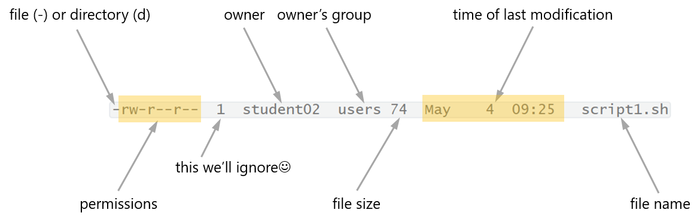

# Class 5

# Working in Linux shell II
  * [Copying files to and from remote server with scp](#copying-files-to-and-from-remote-server-with-scp)
  * [MobaXterm combo (optional)](#mobaxterm-combo-optional)
  * [Shell scripts and echo](#shell-scripts-and-echo)
      * [Exercise 1](#exercise-1)
  * [Setting permissions with chmod](#setting-permissions-with-chmod)
      * [Exercise 2](#exercise-2)
      * [Exercise 3](#exercise-3)
      * [Exercise 4](#exercise-4)
  * [Shell variables](#shell-variables)
  * [Shell scripts continued](#shell-scripts-continued)
      * [Exercise 5](#exercise-5)
      * [Exercise 6](#exercise-6)
  * [Compressing with gzip and archiving with tar](#compressing-with-gzip-and-archiving-with-tar)
      * [Exercise 7](#exercise-7)
  * [Searching and replacing with sed](#searching-and-replacing-with-sed)
    * [Exercise 8](#exercise-8)

***

## Copying files to and from remote server with `scp`

If you work on Windows, you can copy files between your computer and remote server using WinSCP which you can download [here](https://winscp.net/eng/download.php).

After downloading and installing, open WinSCP, in the Login window in the field `Host name:` enter IP address of our server, in the field `User name` enter your user id, don't fill in password. Save your session as `apollo` or another name.  By clicking `Login` you will start connection with the server, you'll be asked for your password and, after verifying your credentials, you'll see in one panel your local computer and in the other your home directory on the remote server.  You can now copy or move files between machines.

> #### `scp` on Linux or Mac
>
> If your computer works under Linux or macOS, you don't need to install anything to copy files between your computer and remote server. You just open terminal and use `scp` (secure copy) program with the following syntax:
>
> `scp [WHAT] [WHERE]`
>
> For example, `scp user102@149.156.165.156:/home/user102/*.txt /home/mary` will copy all `.txt` files from user102 home directory on the remote server to home directory of user `mary` on your local computer.
>
> `scp` can be also used to copy files between different remote servers


## MobaXterm combo (optional)

So far we have been using `PuTTY` to connect to the remote server and above we introduced `scp` for transferring files between computers. An interesting alternative is `MobaXterm` which you can download [here](https://mobaxterm.mobatek.net/download.html). MobaXterm has all functionality of PuTTY, allows opening multiple connections to remote servers in separate tabs, has some `scp` functionality, so allows copying files between your local machine and remote server, and even provides Linux shell on your Windows computer.

We encourage you to explore `MobaXterm` on your own,  and if you like it you can use it instead of PuTTY in the class, but we leave this decision to you.

## Shell scripts and `echo`

Shell commands do not need to be typed directly in terminal. You can save them in a text file and have them executed, line by line. Such files with a set of commands to be executed are called (shell) scripts. We usually use the .sh extension when naming shell scripts.
The first line of the script should contain: 

```bash
#!/bin/bash
```

This line is used by the system to find the script interpreter (shell, or more precisely bash shell).

The following lines contain commands to execute:

```bash
#!/bin/bash
echo My script works!
```

The script above will display in terminal `My script works!`

`echo` prints in the terminal text in the current line, following the first whitespace.

#### Exercise 1

In `nano` write a script that will save the list of `.fasta` files in the directory `~/hiv` to the file `List_of_fasta_files.txt` in your home directory, and then will print in terminal sentence `Task completed!`. Please name script `script1.sh` and save it in your home directory.

---

## Setting permissions with `chmod`

To run a script you need to set appropriate **permissions** so that the script can be **executed** by the user.

> #### Permissions in Linux
>
> In Linux users have three types of permissions for accessing files:
>
> * `r` user can read file
> * `w` user can write to file
> * `x` user can execute file
>
> Each files has defined three groups of users:
>
> * `u` owner or user
> * `g` owner's group - all users that are in the same group as the owner
> * `o` others - all users that do not belong to the owner's group
>
> To see permissions of a file use `ls -l [FILENAME]`
>
> 
>
> * three first positions - owner's permissions (here: `r` and `w`)
> * three next positions - owner's group members permissions (here: only `r`)
> * three last positions - other users (here: only `r`)

#### Exercise 2

What are permissions for `script1.sh` in your home directory? Who is its owner?

---

You can change permissions with `chmod` (change file mode)

> #### `chmod` syntax
>
> `chmod [PERMISSIONS] [FILENAME]`
>
> Syntax of permissions consists of three parts:
>
> 1. Whose permissions to change `[ugoa]` (`u`: owner, `g`: group, `o`: others, `a`: all)
> 2. How to change them `[+-]` (`+`: add permission, `-`: remove permission)
> 3. Which permission to change `[rwx]` (`r`: to read, `w`: to write, `x`: to execute)
>
> Non-privileged user (not administrator) can change permission for his/her own files.

> #### `chmod` examples
>
> `chmod u+x file.txt` gives the owner permission to execute the file
>
> `chmod a-r file.txt` removes permission to read the file for all
>
> `chmod o+rw file.txt` gives others permission to read and write the file

#### Exercise 3

Give all users permissions to read and execute file `script1.sh`. Now, list all files in your home directory. In which colour was the name of your script displayed? Use `ls -l` to check whether your script has indeed the permissions you wanted it to have. What's in the permissions field?

Now you can run the script typing: `./filename.sh`  (what's the meaning of the dot at the beginning of the command?)

----

#### Exercise 4

Run `script1.sh` and check whether it worked. Did file `List_of_fasta_files.txt` appear in your home directory. Did the message `Task completed!` appear in the terminal?

---

## Shell variables

Imagine the following situation. You need to do some analysis that involves a series of operations on a text file (say 30). You are writing a script containing 30 needed commands. The script works fine. However, you expect that you will want to perform the same analysis with other files in the future. You could, of course, give the same name to every file you want to analyse - but that way it's easy to get confused with your own data. Is it possible to write a script in some clever way so that in the future you won't have to rename the file in 30 command lines? This can be done by defining a **variable**.

A variable can be defined inside script, it can also be defined directly in terminal.

> #### Defining variable
>
> ````bash
> variable=value
> ````
>
> To the left of the equal sign (`=`) is the name of variable, to the right of the equal sign is the value of variable. **Important!** no spaces are allowed before and after `=`.
>
> Valid variable names contain letters, digits and underscores, and must start with a letter or underscore. 
>
> Examples of valid variable names:
>
> * `my_variable`
> * `_myvariable`
> * `MyVariable1`
>
> Examples of invalid variable names:
>
> * `1st_variable` (starts with digit)
> * `vari#able` (contains `#`)
> * `my variable` (contains space)
>
> The rules for the values of variables are a bit complex. For now, remember that if the value of your variable contains spaces or some complex characters, it's a good idea to enclose it in quotes. If you want the value of variable to be treated literally, it's a good idea to enclose it in single quotes 
> `'  '`, e. g. `my_variable='This is the content of the variable'`

> #### Referring to variable
>
> Wherever you want to use the value of variable you refer to it by adding `$` in front of its name. For example, if you want to print in the terminal the value of `my_variable` defined above you'll use the command `echo $my_variable`. Try it!
>
> Imagine that we want to write a script in which we take first two lines from a file and save it in file with (almost) the same name, just adding `L2_` as prefix. To do that you can use the following code - you can run it directly from the terminal or as a shell script
>
> ```bash 
>   cd hiv
>   my_file='KT183271.fasta'
>   head -2 $my_file > L2_"$my_file"
>   cd ..
> ```
>
> **Note!** Because we wanted the value of the variable `my_file` to be a part of the name of a new file, we enclosed it in double quotes `""`.  This is related to a complex topic of shell expansion, discussed in many places on the web, for example [here](https://mywiki.wooledge.org/Quotes).

## Shell scripts continued

We can wrap the commands from the previous section into a script. Use `nano` to create `script2.sh`:

```bash
#!/bin/bash
my_file=KT183271.fasta
cd hiv
echo $my_file
head -2 $my_file > L2_"$my_file"
cd ..
```

Note, that in this script we entered directory `hiv` where `.fasta` files are located, and at the end of the script we moved one directory up, back to the home directory. In this way we can refer to the files in this directory directly, without specifying path. 
Save `script2.sh`, exit `nano` and run script in terminal `./script2.sh`. **Tip**: when writing a script it's a good idea to test individual commands in terminal. To do that, it's handy to have another PuTTY session open - you can open as many terminal windows as you want.

A script can be written in such a way that we pass variables (for example, names of files on which the script operates) to the script. One of the ways of passing variables is to use command line arguments. In bash variable names `1` to `9` are reserved for command line arguments. 
You refer to these command line arguments inside your script by typing `$1`, `$2` etc.

Armed with this knowledge we can modify `script2.sh` and save the modified version as `script3.sh`:

```bash
#!/bin/bash
cd hiv
echo $1
head -2 $1 > L2_"$1"
cd ..
```

The script is now a bit shorter and we run it providing file name as command line argument: `./script3.sh KT183271.fasta`

#### Exercise 5

Write script `script4.sh` and save it in your home directory. Within the script define variable `n` and assign to it an integer from the range 1 to 20. Script should:

1. Print number `n` in terminal.
2. Print in terminal `n` first nucleotides from each of `n` lines at the end of the file `KT183271.fasta` which is in directory `hiv`. **Tip1**: use pipe. **Tip2** `-c` option of `cut` may be useful.

Set appropriate permissions and run the script in terminal.

----

> #### Comments inside shell scripts
>
> Inside a script you can include comments that will not be interpreted by shell. They can, for example, explain its operation for other users (or the future you!). Comments start with `#`, can be in separate lines or can follow shell comments in the same line. Comments can be included anywhere in the script **except the first line**, where `#` has a special meaning.

#### Exercise 6

Write script `script5.sh` and save it in your home directory. This script should do the same operations as `script4.sh` from Exercise 5, but `n` should be the first command line argument (`$1`), and the name of the file from which parts of the last lines will be printed should be the second command line argument (`$2`). Within the script include comments explaining the meaning of the two command line arguments. As previously, set permissions and run the script in terminal.

---

## Compressing with `gzip` and archiving with `tar`

To save space and speed up transfer via network files are often **compressed**. This is particularly important for large text files, as their size can be reduced several-fold. Some types of files, such as many audio/video files, jpeg images or pdf files are already compressed, so further compression doesn't reduce their size.

The standard compression and decompression utility in Linux is `gzip`.  Its basic usage is extremely simple: `gzip [FILENAME]` will create file with the name identical to the original file with `.gz` suffix added. 

> #### `gzip` useful options
>
> You can compress (or decompress - see below) multiple files by specifying their names as `gzip` arguments, explicitly, or using wildcards. 
>
> `-k` keep the original file. By default, the original version will be replaced with gzipped `.gz` file
>
> `-r directory` compress all the files within the directory and all its subdirectories
>
> `-d [FILENAME]` decompress file. Decompressed file will replace the `.gz` file

> #### `.zip` archives in Linux
>
> `gzip` is not able to work with `.zip` files popular under Windows. Many Linux systems include `zip` and `unzip` programs.

`gzip` operates only on single files, it doesn't create multifile archives.  There's another standard tool for creating and working with multifile archives - `tar`. Often, files are first added to a `.tar` archive and the archive is then compressed with `gzip`. Note that when you have to copy or transfer via network many (hundreds, thousands) small files, the process will be slow, because most of the time is used up on opening and closing connections for individual files. If you combine all files into a single `.tar` archive, copying or transferring will be much faster, even if you don't compress the archive.

> #### `tar` useful options
>
> `tar` is an old (but up-to-date and widely used) utility, therefore it has several ways of specifying its options.  The one we'll use below starts with `-` , then options follow, with `f` as the last one followed by the name of the `.tar` or `.tar.gz` archive.
>
> `-cvf [FILENAME] [WHAT]` create (`c`), verbosely show progress (`v`) and save to file (`f`)  `[FILENAME]` content of `[WHAT]` (can be directory or list of files specified using their names or wildcards. This archive will not be compressed
>
> `-cvzf [FILENAME] [WHAT]` as above but the archive will be gzipped
>
> `-xvf [FILENAME]` extract content of the archive to the current directory (works also for gzipped `.tar` archives)
>
> `-xvf [FILENAME] -C [DIRCTORY]` extract content of the archive to the specified directory
>
> `-tvf [FILENAME]` list content of the archive (works also for gzipped `.tar` archives)
>
> `-xvf [FILENAME] [FILE-TO-EXTRACT]` extracts single file form `.tar` archive`

#### Exercise 7


In your home directory create gzipped `.tar` archive named `hiv_all.tar.gz` containing all `.fasta` files from `~/hiv`. List content of this archive.

---

## Searching and replacing with `sed`  
`sed` is a stream text editor with many advanced facilities. 
You can find out about them [here](https://www.gnu.org/software/sed/manual/sed.html).  
But, it is usually used for two very simple tasks: 

1. Searching and replacing a text  (or a regular expressions) in the text file
2. Selecting lines by numbers 
> 
> Substituting the phrase `"text1"` with `"text2"` in file `infile` (first task):  
>  ```bash
>   ## replacing only the first occurrence of "text1" within each line of the input file
>   ## result written to the outfile
>   sed 's/text1/text2/' infile > outfile 
>   
>   ## replacing all occurrences of "text1" in each line of the input file
>   ## result written to the outfile
>   sed 's/text1/text2/g' infile > outfile
> 
>   ## replacing all occurrences of "text1" in each line of the input file in place:
>   sed -i  's/text1/text2/g' infile
> ```
> Extracting lines from the text file (second task):  
> ```bash
>   ## extracting lines from 3 to 6 from the input file
>   sed -n 3,6p infile > outfile
> 
>   ## extracting line 24 from the input file
>   sed -n 24p infile > outfile
> ````
>  Both tasks at once:
> ```bash
>   ## replacing all occurrences of "text1" with "text2" in the 6th line of the file:
>   sed '6s/text1/text2/g' infile > outfile
> ```


### Exercise 8  
Transform `Ex_02_2.txt` (you should have this file in your home directory; if not, download 
it from `https://www.dropbox.com/s/gruaw8vqgnwas8l/Ex_02_2.txt`) into a comma delimited file. Write the result to the new file named `Ex_02_2.csv`. 
**Tip** Use sed and the symbolic representation of <kbd>Tab</kbd>: `\t`. 
Now, try to change all lowercase letters in the header (first line) of the resulting file to the corresponding uppercase letters. 
**Tip** You can use `.*` as the searched regular expression (to be replaced) and `\U&` as the "new text". Save the resulting file as `Ex_02_2_upper.csv`.  
This solution was found [here](https://stackoverflow.com/questions/22718518/sed-to-replace-lower-case-string-between-two-strings-to-upper-case).    
How to perform both steps in one command? Try it!  


[Return to the top](#working-in-linux-shell-ii)
