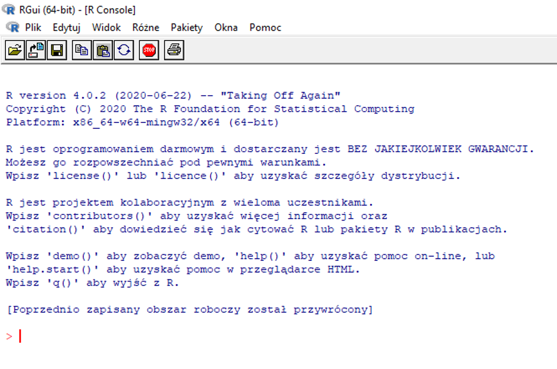

```{r setup, include=FALSE}
knitr::opts_chunk$set(echo = FALSE)
```

## What is R?

R is a powerful programming language, broadly used for:

-   data processing
-   statistical analysis
-   production of highly-customizable, publication quality graphs
-   computer simulations
-   ... and much more

R is a particularly popular tool in biology, so knowing the basics of R is an important asset of any biologist.

## Installation

To install R for Windows follow the [link](https://cran.r-project.org/bin/windows/base/) and then click on "Download - *version\_number* - for Windows" As of the time of writing the currect R version was 4.2.1.  
To install R for OS X (Macs) follow the [link](https://cran.r-project.org/) and then click on "Download R for (Mac) OS "  
To install R for Linux type the following lines in the terminal:

``` bash
sudo apt-get update
sudo apt-get install r-base
```

Run R. You should see a window similar to the one below. Your language version may differ, below is the Polish one. Language version don't affect the commands of the R language itself



It is so called R console. Anything written and executed within a console will be interpreted (calculated) by R and usually R will print out something in the console.

## R as a calculator

R understands standard mathematical operators: `+` (addition), `-` (subtraction), `*` (multiplication), `/` (division) and `^` (raising to a power).


#### Exercise 1

Sum up all integers from 1 to 10 using the `+` operator.

Expected result:
```{r}
ex1 <- sum(c(1:10))
ex1

```


------------------------------------------------------------------------

#### Exercise 2

Raise the result of exercise 1 to the power of 5.

Expected result:
```{r}
ex2 <- ex1^5
ex2
```

------------------------------------------------------------------------

> R also provides two additional operators:
>
> `%%` - **modulus** - returns the remainder from the division of one number by another, e. g., `10 %% 3 = 1`
>
> `%/%` - **integer division** - returns how many times one number is contained in the other, e. g., `10 %/% 3 = 3`

#### Exercise 3

For numbers 10, 156, 557, 777 and 1055, check which are divisible by
7 (i.e., divisible without remainder).

------------------------------------------------------------------------

Because its enormous importance in science  π value can be obtained
just by typing `pi`.

#### Exercise 4

Calculate the area of circle which radius equals 40 meters.  

Expected result:

```{r}
pi*40^2
```

------------------------------------------------------------------------

> #### Order of operations
>
> R uses the standard order of mathematical operations. However, it is usually a good practice to use parentheses to be explicit.

> #### Built-in functions
>
> R provides a number of commonly used mathematical functions, such as:  
> `log()` natural logarithm  
> `log10()` logarithm with base 10  
> `exp()` raises the Euler number (e, the base of the natural logarithm) to a given power 
> `sin()`, `cos()`, `tan()` trigonometric functions  
> `abs()` absolute value  
> The argument of a function is provided in parentheses, e.g., exponent  of e for `exp()` or the angle in radians for trigonometric functions.

#### Exercise 5

Calculate the natural logarithm and logarithm with base 10 of 1000.  

Expected result:

```{r}
log(1000)
log10(1000)
```

------------------------------------------------------------------------

## RStudio

RStudio is a shell and programming environment for the R language. It makes working with R much easier and more intuitive by providing a user interface to R features originally hidden behind R functions and R console. However, remember that the same actions can be performed within the classical R console, e.g., if you work on a remote server without GUI.

### Installation and appearance

Follow the [link](https://rstudio.com/products/rstudio/download/), choose the appropriate operating system and install RStudio. Bear in mind that R needs to be installed first (as we did here).

RStudio has three major advantages over the classical R console:

- you can easily save and edit your code as a text file (give it `.R` extension)  
- running any piece of previously written code (reanalysis)
- displaying all R objects and variables saved in your computer memory at any given moment you can check whether R is doing behind the scenes what you think is doing
- projects (see next class)

The R Studio workspace consists of four main panels:


1. **Code editor** - write your code and save it in a text file (.R).You can run it anytime by highlighting a given piece of code and clicking `Run` in right-top corner (or pressing    <kbd>Ctrl</kbd>+<kbd>R</kbd>).
2. **Console** - Exactly the same console as in standard R (see above). Note that any line of code run from *Code editor* will appear in the console. To recall the lastly run line of code use <kbd>↑</kbd> (it works as a general way of browsing through the history of the    previously executed commands).
3. **Environment / History**
    -   `Environment` - see all variables (including their current
        values) and functions present in your computer’s memory (RAM).
        Have in mind they will be lost as soon as you close RStudio.
    -   `History` - access to the entire code run in a given RStudio
        session.
4.  **Files / Plots / Help / Packages**
    -   `Files` - manage files on your computer.
    -   `Plots` - preview generated plots before saving them.
    -   `Help` - access help page (often with examples) for a given
        function.
    -   `Packages` - manage all additionally installed modules.

#### Exercise 6

Create new script file `File -> New File -> R Script` and save it. Write code for all subsequent exercises using Code editor and save it in the script. Remember that to obtain any result you have to execute/run your code first.

------------------------------------------------------------------------

> #### Comments
>
> If you want to include some comments within a script file or “turn off” a chunk of code, type `#` hash before it, exactly as you’d do in a bash script. Anything written until the end of a given line will be ignored by R. To comment several lines highlight them and use <kbd>Ctrl</kbd>+<kbd>Shift</kbd>+<kbd>C</kbd>. To uncomment use the same keyboard shortcut once again.

## Variables

We know already bash variables. Here a bit more about variables in R. Until you name something it does not exist in the computer memory! Any result of the execution of a command within the console perishes when the calculation is finished, unless you assign it to a variable. So, roughly speaking, named objects within the computer memory are called “variables”. You can create one by using arrows (assignment symbol) in the following manner:

`variable_name <- object_to_be_assigned`

You can easily recall the value of the variable later on by typing its name. The assignment operation is common and there’s a handy keyboard shortcut <kbd>Alt</kbd>+<kbd>-</kbd>.

#### Exercise 7

Assign `5` to a variable, giving it any name you want. Then type the name in console and press <kbd>Enter</kbd>.  

Expected result:

```{r}
a <- 5
a
```

------------------------------------------------------------------------

> #### Naming variables
>
> Variable names are case sensitive and cannot contain blank spaces or start with a digit (similar as in bash). When you want to combine several words into a single name use the underscore (`_`). By convention dots are used for function names and, while allowed, they are not recommended in variable names.

Once an object is assigned to variable, its name can replace the value of the object in any R command, e. g., if `2` is assigned to `x`, both `2 + 3` and `x + 3` would produce the same result `5`.

#### Exercise 8

Assign your day of birth and month of birth (integer) to two separate variables. Then calculate the sum of these two variables and assign it to variable `day_month`. Call the variable to see the result.

------------------------------------------------------------------------

Variables can be overwritten by assigning a new object to an already used variable name. Once you overwrite the variable, its old value disappears for good.

#### Exercise 9

Change the value of `day_month` by increasing its value by 20%. Call it.

------------------------------------------------------------------------

Of course not only numerical values can be stored in variables. Another very popular type of data is `string`. It is text which behaves as a single object regardless of its length. To distinguish strings from variable names R requires enclosing them in quotation marks.

#### Exercise 10

Assign your name to variable `my_name`. Call it.

------------------------------------------------------------------------

## `str()` and understanding the structure of R objects

When in doubt about the nature of any named R object, be it a named variable, function, dataset, you can learn a lot about what it is using `str()` function. Please consult manual of `str()` by invoking `?str` and test yourself some of the examples provided in the manual.
