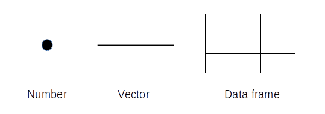

Class 8: Data in R
================
Tomasz Gaczorek & Wiesław Babik
2022-07-12

-   [Functions](#functions)
    -   [Exercise 1](#exercise-1)
    -   [Exercise 2](#exercise-2)
    -   [Exercise 3](#exercise-3)
-   [Vectors](#vectors)
    -   [Exercise 4](#exercise-4)
    -   [Exercise 5](#exercise-5)
    -   [Exercise 6](#exercise-6)
    -   [Exercise 7](#exercise-7)
    -   [Exercise 8](#exercise-8)
-   [Operations on vectors](#operations-on-vectors)
    -   [Exercise 9](#exercise-9)
    -   [Exercise 10](#exercise-10)
    -   [Examples:](#examples)
        -   [Exercise 11](#exercise-11)
-   [Accessing elements of a vector](#accessing-elements-of-a-vector)
    -   [Exercise 12](#exercise-12)
    -   [Exercise 13](#exercise-13)
    -   [Exercise 14](#exercise-14)
    -   [Exercise 15](#exercise-15)
-   [Working directory](#working-directory)
    -   [Exercise 16](#exercise-16)
-   [Let’s start some real work!](#lets-start-some-real-work)
-   [Data frames](#data-frames)
-   [Data import and display](#data-import-and-display)
    -   [Exercise 17](#exercise-17)
    -   [Exercise 18](#exercise-18)
    -   [Exercise 19](#exercise-19)
    -   [Exercise 20](#exercise-20)
    -   [Exercise 21](#exercise-21)
-   [Types of data](#types-of-data)
    -   [Exercise 22](#exercise-22)

## Functions

The usual ways to deal with your data in R is to use functions. They are
simply named lists of commands residing in a computer memory that
(usually) take argument(s), perform desired operations and often return
a result. Functions we used before take only a single argument, e.g.,
log() takes a number. However, functions often take multiple arguments,
some of them optional. List of arguments and the way of using them,
together with examples of usage can be found in function’s manual or
help page. In RStudio information about a function can be invoked by
typing `?` followed by the function name.

#### Exercise 1

Open the manual for `paste()` function

------------------------------------------------------------------------

> #### Function manual
>
> Usually a manual contains seven sections:  
> - `Description` - what the function does  
> - `Usage` - syntax  
> - `Arguments` - names of arguments passed to the function and their \>
> meaning  
> - `Details` - detailed description of the function behaviour  
> - `Value` - the type of object the function returns  
> - `References` - usually a book or article where the function was
> described for the first time or substantially modified  
> - `Examples` - examples of usage

#### Exercise 2

Use `paste()` to stick together the following words
`"I'm",`“using”`and`“R”\`. Don’t forget about quotation marks.

Expected result:

    ## [1] "I'm using R"

------------------------------------------------------------------------

Arguments passed to functions often have their own names. Distinctive
names are crucial, because many functions take multiple arguments that
have to be distinguished. Such named arguments are passed using the
following pattern: `argument_name = argument_value`.

#### Exercise 3

Use the same function as above but set argument called `sep` (separator)
to `_`.

Expected result:

    ## [1] "I'm_using_R"

------------------------------------------------------------------------

Note that whitespaces were replaced with underscore. However, where did
the blank spaces come from at the first time? The answer is that some
arguments have their default values that would be taken if no value for
this argument is provided when calling the function. In the example
above case the default value for `sep` argument is space.

> #### Use argument names!
>
> It’s a good practice to use argument names while calling a function.
> Although R can often “guess” the argument name from the order in which
> arguments appear, this not always works, especially, when the number
> of arguments is not strictly defined (`...` in the function
> description). Another reason for using argument names is code
> readability, which is important for other users and for the future
> you! Try to stick to this rule as much as you can, although we admit
> that in commonly used functions with limited number of arguments it’s
> not always necessary.

## Vectors

Vector is a series of elements (commonly numbers or strings) that are
saved as a single variable. A new vector can be created with `c()`
function in the following manner: `c(value_1,value_2,value_3,...)`.

#### Exercise 4

Create a vector containing integers from 5 to 10 and save it to a
variable. Call it. Expected result:

    ## [1]  5  6  7  8  9 10

------------------------------------------------------------------------

To create a vector of consecutive integers you can type the limits of
the range separated by a colon.

#### Exercise 5

Create a vector containing integers from 1 to 100 and save it to a
variable `one_to_hundred`. Call it.

Expected result:

    ##   [1]   1   2   3   4   5   6   7   8   9  10  11  12  13  14  15  16  17  18
    ##  [19]  19  20  21  22  23  24  25  26  27  28  29  30  31  32  33  34  35  36
    ##  [37]  37  38  39  40  41  42  43  44  45  46  47  48  49  50  51  52  53  54
    ##  [55]  55  56  57  58  59  60  61  62  63  64  65  66  67  68  69  70  71  72
    ##  [73]  73  74  75  76  77  78  79  80  81  82  83  84  85  86  87  88  89  90
    ##  [91]  91  92  93  94  95  96  97  98  99 100

------------------------------------------------------------------------

> #### Ranges in R
>
> R considers ranges fully inclusive, which means that both limits of
> the range will be included in the generated vector.

To create a vector of consecutive numbers which differ by a given value,
use `seq()` function. Note that the function will return a vector so
there’s no need to use `c()`.

#### Exercise 6

Consult `seq()` manual and then, using `seq()` function, create a vector
of numbers between 0 and 1 that differ by 0.1.

    ##  [1] 0.0 0.1 0.2 0.3 0.4 0.5 0.6 0.7 0.8 0.9 1.0

------------------------------------------------------------------------

To create a vector of repeated values, use `rep()` function:

#### Exercise 7

Consult `rep()` manual and then, using `rep()` function, create a vector
consisting of a sequence of 1, 2 and 3 repeated 20 times. Save it as a
variable `repeated` and call the variable. Expected result:

     [1] 1 2 3 1 2 3 1 2 3 1 2 3 1 2 3 1 2 3 1 2 3 1 2 3 1 2 3 1 2 3 1 2 3 1 2 3 1 2
    [39] 3 1 2 3 1 2 3 1 2 3 1 2 3 1 2 3 1 2 3 1 2 3

------------------------------------------------------------------------

**All elements of a vector have to be of the same type.** While you try
to combine elements of different types, R will convert all of them to
the most “general” type (more on types later).

#### Exercise 8

Create a vector from 1 to 4 with odd numbers typed as integers and even
numbers typed as strings (e.g., “2”). What is the outcome? A vector of
integers or a vector of strings? Why?

------------------------------------------------------------------------

## Operations on vectors

> ### Useful functions
>
> `min()` - minimum value  
> `max()` - maximum value  
> `sum()` - sum of all elements in a vector  
> `prod()` - product of all elements in a vector  
> `mean()` - the average of all elements in a vector  
> `median()` - median  
> `length()` - the number of elements in a vector  
> `sort()` - sort values (default is ascending order, use
> `decreasing = TRUE` to sort in descending order)  
> `unique()` - return unique values, i. e., discard duplicates  
> `round()` - round numbers (to integers by default)

#### Exercise 9

Calculate the mean and median of vector `one_to_hundred` from Ex. 5.

Expected results:

    ## [1] 50.5

    ## [1] 50.5

------------------------------------------------------------------------

#### Exercise 10

Sort vector `repeated` from Ex. 7 and return its unique values.

Expected result:

    ##  [1] 1 1 1 1 1 1 1 1 1 1 1 1 1 1 1 1 1 1 1 1 2 2 2 2 2 2 2 2 2 2 2 2 2 2 2 2 2 2
    ## [39] 2 2 3 3 3 3 3 3 3 3 3 3 3 3 3 3 3 3 3 3 3 3

    ## [1] 1 2 3

------------------------------------------------------------------------

You can perform standard mathematical operations on vectors, which, as
you will see, is very handy in data analysis. There is an important rule
to remember: shorter vector will be **recycled** (repeated) until it
reaches length of the longer one (single number is treated as vector of
length 1).

### Examples:

``` r
c(1,2,3,4) + 5      # 5 is added to each element, the same as c(1,2,3,4) + c(5,5,5,5)
```

    ## [1] 6 7 8 9

``` r
c(1,2,3,4) + c(1,2) # the same as c(1,2,3,4) + c(1,2,1,2)
```

    ## [1] 2 4 4 6

#### Exercise 11

Raise each element of vector `one_to_hundred` to the power of 3. Assign
result to variable `power_3`.

Expected result:

    ##   [1]       1       8      27      64     125     216     343     512     729
    ##  [10]    1000    1331    1728    2197    2744    3375    4096    4913    5832
    ##  [19]    6859    8000    9261   10648   12167   13824   15625   17576   19683
    ##  [28]   21952   24389   27000   29791   32768   35937   39304   42875   46656
    ##  [37]   50653   54872   59319   64000   68921   74088   79507   85184   91125
    ##  [46]   97336  103823  110592  117649  125000  132651  140608  148877  157464
    ##  [55]  166375  175616  185193  195112  205379  216000  226981  238328  250047
    ##  [64]  262144  274625  287496  300763  314432  328509  343000  357911  373248
    ##  [73]  389017  405224  421875  438976  456533  474552  493039  512000  531441
    ##  [82]  551368  571787  592704  614125  636056  658503  681472  704969  729000
    ##  [91]  753571  778688  804357  830584  857375  884736  912673  941192  970299
    ## [100] 1000000

------------------------------------------------------------------------

## Accessing elements of a vector

Vector can be subset in the following manner:
`vector_name[element_index]`.

#### Exercise 12

Return 15<sup>th</sup> element of the vector `power_3`.

Expected result:

    ## [1] 3375

------------------------------------------------------------------------

Colon can be used for ranges just as when creating vector.

#### Exercise 13

Return 2<sup>nd</sup> to 20<sup>th</sup> elements of the vector
`power_3`.

Expected result:

    ##  [1]    8   27   64  125  216  343  512  729 1000 1331 1728 2197 2744 3375 4096
    ## [16] 4913 5832 6859 8000

------------------------------------------------------------------------

To obtain multiple, non-consecutive elements of a vector, use vector as
`element_index`.

#### Exercise 14

Return 15<sup>th</sup>, 30<sup>th</sup> and 45<sup>th</sup> elements of
the vector`power_3`.

Expected result:

    ## [1]  3375 27000 91125

------------------------------------------------------------------------

#### Exercise 15

Create a vector consisting of indexes used in Ex. 13 and 14 and assign
it to a variable. Return corresponding elements of the vector `power_3`.
When creating a vector, you can combine both ranges and single indexes
with `c()` function.

Expected result:

    ##  [1]     8    27    64   125   216   343   512   729  1000  1331  1728  2197
    ## [13]  2744  3375  4096  4913  5832  6859  8000  3375 27000 91125

------------------------------------------------------------------------

> #### Saving history
>
> To save your code written during the class, type the commands below to
> save the R history. Change file name to include your surname and send
> it to your course instructor via email.
>
> ``` r
> savehistory(file = "my_history.txt")     # saves your R history to the file "my_history.txt"
> getwd()                                  # displays where the file was saved
> ```

## Working directory

Working directory is a folder on your computer where R is operating at
the moment. Think about it as a separate room for a given analysis. R
will look for and save all files in the working directory by default.
You can check the current working directory by typing `getwd()`. To set
new working directory in RStudio
use`Session -> Set Working Directory -> Choose Directory` or use
`setwd()` function with a destination path provided as an argument -
don’t forget about quotes.

Unless you continue a previous analysis, ALWAYS set the new working
directory.

#### Exercise 16

Create a new folder and set it as your working directory.

------------------------------------------------------------------------

## Let’s start some real work!

Before performing any new analysis in RStudio make sure three things are
done:

1.  The appropriate working directory is set.
2.  New R script file with extension `.R` is created
    (`File -> New File -> Rscript`).
3.  Global environment is empty. You can clear it by clicking the
    **broom icon** in the `Environment` panel or by typing
    `rm(list = ls())`

## Data frames

The picture below visualises differences between numbers (or strings),
vectors and data frames:



Data frame is something you probably know as “table”, similar to, e. g.,
spreadsheet table. Data frame has, however, some unique characteristics:

1.  It always has a header which means that each column must have its
    unique name. If names are not provided by the user, R creates them
    automatically as `V` (as “Variable”) followed by consecutive
    numbers.
2.  Data frame is always complete. It means that each column has the
    same number of rows. If some data are missing R puts `NA` (“Not
    Available”) in a given cell.
3.  An individual column of a data frame, similarly to vectors, can
    contain only a single type of data, but different columns can be of
    different types.

## Data import and display

Usually, data imported into R are in the form of text files. Commonly
used extensions:

-   `.csv` - comma-separated values - rows defined as lines of text,
    columns separated by `,` (see Class 2, remember about dialects, for
    example Polish uses `;` instead of `,` )
-   `.tsv` - tab-separated values - rows defined as lines of text,
    columns separated by `tab` (see Class 2)
-   `.txt` - can be any of these or some other form of text file. If not
    properly structured may be challenging to get into R in the correct
    form.

#### Exercise 17

Copy and execute the command below to download the file `CO2.csv` we are
going to work with, to your working directory: \`

``` r
download.file(url = "https://www.dropbox.com/scl/fi/lj3nkgwbaiblwo9jyt0qs/CO2.csv?rlkey=jrv1inqfrej7i9ezlduytxqjh&dl=0",
              destfile = paste(getwd(),"/CO2.csv",sep = ""))
```

------------------------------------------------------------------------

> #### Built-in datasets
>
> R provides many training datasets that are built-in into R and can be
> called directly by their names. Their list of them can be obtained by
> calling `data()` function. The description of each dataset can be
> accessed by typing `?` followed by its name. `CO2` is one of built-in
> datasets, however, we downloaded it manually to learn how to import
> external datasets.

#### Exercise 18

Open description of `CO2` dataset. Check the description of the study
and the meaning of column headers.

------------------------------------------------------------------------

#### Exercise 19

Import `CO2.csv` file into R with `read.table()` function and assign it
`my_data` variable. Check function manual for the information about its
arguments values. Call `my_data`. First 10 lines of the expected output
are shown below:

    ##    Plant   Type  Treatment conc uptake
    ## 1    Qn1 Quebec nonchilled   95   16.0
    ## 2    Qn1 Quebec nonchilled  175   30.4
    ## 3    Qn1 Quebec nonchilled  250   34.8
    ## 4    Qn1 Quebec nonchilled  350   37.2
    ## 5    Qn1 Quebec nonchilled  500   35.3
    ## 6    Qn1 Quebec nonchilled  675   39.2
    ## 7    Qn1 Quebec nonchilled 1000   39.7
    ## 8    Qn2 Quebec nonchilled   95   13.6
    ## 9    Qn2 Quebec nonchilled  175   27.3
    ## 10   Qn2 Quebec nonchilled  250   37.1

------------------------------------------------------------------------

> #### Prevewing and viewing tables
>
> While importing a new file int R, it’s a good practice to display it
> before in any simple, external text editor (e.g., Notepad++) to see
> its structure. It helps to set the arguments of `read.table()`
> properly. Displaying tables in a console is often not very
> informative, especially when the number of columns or rows is large. R
> Studio provides an easy tool for intuitive visualization of data
> frames. It’s `View()` function (note that it starts with a capital
> letter). You can call it also by simply clicking on a data frame
> within the `Environment` panel.

#### Exercise 20

Call built-in dataset `infert`. Can you see the entire table? If not,
what is missing? Write your answer as a comment within the script file.

------------------------------------------------------------------------

#### Exercise 21

Display `my_data` from Ex. 19 with `View()` function. In the view
windows click on a column header to sort the data according to the
values in a given column. In which region CO2 uptake is the highest?
Write your answer as a comment within the script file.

------------------------------------------------------------------------

> #### Quick summaries
>
> To print the summary of a data frame in the console, use `summary()`
> function. It will provide simple statistics for each column
> separately. You can display a few rows from the beginning of data
> frame with `head()` and from the end of data frame with `tail()`.

## Types of data

All values inside a single data frame column must be of the same data
type, but the columns can be of different types. Type of data within a
column is defined by its **type**. The most popular types are:

-   `character` - strings (remember that numbers enclosed in quotation
    marks are also treated as strings)
-   `factor` - strings with the levels carrying information about the
    number of occurrences and order of strings. Factors are commonly
    used when doing statistics in R, where they serve as indicators of
    the [nominal
    scale](https://www.statsdirect.com/help/basics/measurement_scales.htm).
    Set as default for columns with strings. To change this behavior set
    the `stringAsFactors` argument of importing function to `FALSE`.
-   `double` - real (floating point) numbers
-   `integer` - integer. Both `integer` and `double` can be interpreted
    as numbers, therefore they together constitute type `numeric`.
-   `logical` - logical values (`TRUE` or `FALSE`)

> #### Conversion between types
>
> You can convert different data types with the use of `as...` function
> family, e.g., `as.character()`, `as.factor()` etc. Note, however, that
> not all conversions are permitted, e.g., a letter cannot be converted
> into an integer. The general rule is that a simpler type can always be
> represented as a more complex type, but generally not vice versa.
> Types in the order of increasing complexity: `logical`, `integer`,
> `character` To change class of a column you need to replace the entire
> column with the result of *as..* function.

Column type can be checked by displaying data frame with `View()`
function and placing mouse cursor over the column header.

#### Exercise 22

Check the class of column `uptake`. Write your answer as a comment
within the script file.

------------------------------------------------------------------------

Column type can also be checked with `typeof()` or `class()` functions,
the latter providing more detailed information.
