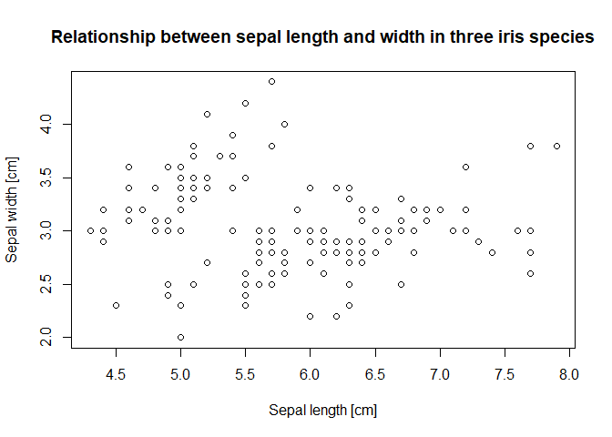

Class 10: Plotting: base R
================
Wiesław Babik
2022-12-23

- <a href="#plotting" id="toc-plotting">Plotting</a>
  - <a href="#exercise-1" id="toc-exercise-1">Exercise 1</a>
- <a href="#scatterplot" id="toc-scatterplot">Scatterplot</a>
  - <a href="#the-basic-scatterplot" id="toc-the-basic-scatterplot">The
    basic scatterplot</a>
  - <a href="#saving-a-plot" id="toc-saving-a-plot">Saving a plot</a>
  - <a href="#exercise-2" id="toc-exercise-2">Exercise 2</a>
  - <a href="#adding-features" id="toc-adding-features">Adding features</a>
  - <a href="#further-customisation" id="toc-further-customisation">Further
    customisation</a>
  - <a href="#exercise-3" id="toc-exercise-3">Exercise 3</a>
  - <a href="#colouring-points-according-to-species"
    id="toc-colouring-points-according-to-species">Colouring points
    according to species</a>
  - <a href="#adding-legend" id="toc-adding-legend">Adding legend</a>
- <a href="#histogram" id="toc-histogram">Histogram</a>
  - <a href="#exercise-4" id="toc-exercise-4">Exercise 4</a>
  - <a href="#coloured-histograms-for-each-species-on-a-single-plot"
    id="toc-coloured-histograms-for-each-species-on-a-single-plot">Coloured
    histograms for each species on a single plot</a>
- <a href="#whats-next" id="toc-whats-next">What’s next?</a>

## Plotting

We’re now well into our R journey, but so far we were seeing our data
only as text and numbers. This is not enough - as the famous
statistician John Tukey said “*There is no excuse for failing to plot
and look*” - you should always plot and visually inspect your data
before starting any serious analysis. In this class we’ll show how to
create and customise two popular plot types, scatterplot and histogram,
using base R plotting functions. We’ll also explain why base R graphics
can be challenging to use and prepare the ground for using `ggplo2`
package. In today’s class we’ll use the built-in `iris` dataset.

### Exercise 1

Display the `iris` dataset and produce its summary.

## Scatterplot

Scatterplot is one of the most common types of plots, we use it when we
are interested in a relationship between two continuous (or, sometimes,
categorical) variables. To make a meaningful scatterplot your both
variables must be numeric. We’ll use `plot()` function to examine the
relationship between sepal length and sepal width.

### The basic scatterplot

We can explicitly specify what will be plotted on the `x` and `y` axes,
but then, we have to include the name of the dataset twice:

``` r
plot(x = iris$Sepal.Length, y = iris$Sepal.Width)
```

or, we can use the formula notation with the `~` symbol. Then `y ~ x`
says that `y` is a function of `x`. Using this notation we add the extra
argument `data`:

``` r
plot(Sepal.Width ~ Sepal.Length, data = iris)
```

<!-- -->

### Saving a plot

To save a plot in any of the available formats, you have to use a
**graphical device**. There are many of them, for a list see
[here](https://stat.ethz.ch/R-manual/R-devel/library/grDevices/html/Devices.html).
The most popular vector formats are `pdf`, `svg` and `postscript`, while
commonly used bitmap format include `png`, `jpeg` and `tiff`. To save
your graph as `pdf` use:

``` r
pdf(file = "my_scatterplot.pdf")
plot(Sepal.Width ~ Sepal.Length, data = iris)
dev.off()
```

    ## png 
    ##   2

Note that after the plot is created we have to use `dev.off()` to close
the device and save the file. Each device has a number of options
controlling its behaviour, including the size and (in case of bitmap
formats) resolution of the plot.

### Exercise 2

Consult the manual of `tiff` and save the previous plot as `.tif` file
10 x 15 cm at the resolution of 300 ppi.

### Adding features

If you want to add title, you can use parameter `main` within `plot()`
function, while axis labels may be modified with `xlab` and `ylab`.

``` r
plot(Sepal.Width ~ Sepal.Length, data = iris, 
     xlab = "Sepal length [cm]",
     ylab= "Sepal width [cm]",
     main = "Relationship between sepal length and width in three iris species")
```

<!-- -->

If the title is too long you can wrap it by inserting the new line
symbol `\n` in the title string

``` r
plot(Sepal.Width ~ Sepal.Length, data = iris, 
     xlab = "Sepal length [cm]",
     ylab= "Sepal width [cm]",
     main = "Relationship between sepal length and width\n in three iris species")
```

<!-- -->

To adjust the ways the graph is displayed, we can use `par()` function,
which allows to set many plot parameters. Consult the documentation of
this function - there’s plenty of graphical parameters to adjust. We’ll
use `mar` parameter to adjust the plot margins. `mar` takes the value of
four-element numeric vector with the consecutive numbers giving the
bottom, left, top and right margin values. Remember to use `par()`
before plotting

``` r
par(mar = c(5, 5, 5, 5))
plot(Sepal.Width ~ Sepal.Length, data = iris,
     xlab = "Sepal length [cm]",
     ylab = "Sepal width [cm]",
     main = "Relationship between sepal length and width\n in three iris species")
```

<!-- -->

### Further customisation

So now we have a basic scatteplot showing our data, but it fails to
account for the simple fact that we have three different species in our
dataset. We don’t know which point belongs to which species, so we can’t
visually assess the differences (or similarities) between species in the
relationship between sepal length and sepal width. We may want to make
the plot “prettier” by marking each species with different color,
changing the symbol used to plot data points and perhaps add some legend
so that graph becomes self-explanatory.

> ### Points, colours and backgrounds
>
> In R you can use many different point shapes, which you set using
> `pch` parameter within `plot()`. The available point shapes with their
> corresponding numerical values are:
>
> .
>
> Note, that `pch` from 1 to 14 have only coloured outlines while the
> inside is empty, 15-20 are solid symbols, while 21 to 25 have the
> outline and filling (background), which can have different colours.
> You set the colour of symbols 0-20 and outline colour of symbols 21-25
> using `col` parameter within `plot()`, while fill of symbols 21-25 can
> be set using `bg` parameter. Both `col` and `bg` take colour names,
> such as `"red"` or `"darkblue"` or `"gray30"` as values, and the list
> of colours accesible by name can be found
> [here](http://www.stat.columbia.edu/~tzheng/files/Rcolor.pdf). R
> understands names of 657(!) colours, and all their names can be lister
> with `colours()` function (alternative spelling `colors()`). Note that
> colours can be also specified using various schemes of numerical
> values, but this is beyond the scope of our course (look, e.g.,
> [here](http://www.sthda.com/english/wiki/colors-in-r)). Size of the
> symbol can be adjusted using `cex` parameter within `plot()` which
> takes numerical value which specifies how the default size should be
> scaled (`cex = 0.5` make the symbol two times smaller and `cex = 2`
> makes it two times bigger than the default size).

### Exercise 3

Change plotting symbols to diamonds 3 times bigger than the default,
with blue outline and pink fill.

<!-- -->

### Colouring points according to species

By setting `plot()` parameter `col = Species` we make points from each
species of different colour, because we make each unique value (level)
of the variable `Species` correspond to a different colour.

<!-- -->

### Adding legend

The plot above looks nicer but we still don’t know which colour
represents each species, to learn this we need to add legend.

``` r
par(mar = c(5, 5, 5, 5))
plot(Sepal.Width ~ Sepal.Length, data = iris,
     xlab = "Sepal length [cm]",
     ylab = "Sepal width [cm]",
     main = "Relationship between sepal length and width\n in three iris species",
     pch = 16,
     col = Species)
legend(x = "topright",
       legend = levels(iris$Species), 
       col = c(1:3),
       pch = 16)
```

<!-- -->

The use of `legend()` requires some explanation. First, we can specify
the position of legend using two numerical coordinates, `x` and `y`, or,
as in the example above, we can use one of predefined positions passed
as character string value of `x` (see `?legend`). Second, `legend` has
to be provided as character vector; in the above example we used levels
of Species variable which is encoded as factor (see Class 8 Data in R)
in `iris`. Because each factor level was assigned colour according to
the internal R colour numbering starting from 1, by using `c(1:3)` as
the value of `col` parameter in legend we make sure that match between
colours in the plot and legend is correct. Anyway, this is not the most
convenient way of annotating the plot.

## Histogram

Histogram is useful if we want to look at the distribution of the values
of a single variable. The x axis shows the values of a variable (often
binned) and y axis shows the number (or frequency) of observations. Lets
have a look at the distribution of the variable `Sepal.Length`

``` r
hist(iris$Sepal.Length)
```

<!-- -->

That was quick! With a single short command you can have a look at the
distribution of a variable. The `hist()` function comes with a set of
sensible defaults, and if you’re not happy with these, you can customise
almost any aspect of your plot. For example you want to change the
number of categories (bins), or or explicitly specify the limits of the
bins. Both can be set by using `breaks` parameter which can take a
single number, indicating the number of bins, or a numeric vector
indicating bin boundaries.

``` r
hist(iris$Sepal.Length, breaks = c(4, 5, 6, 7, 8, 9))
```

<!-- -->

### Exercise 4

Plot histogram with 10 bins, label x axis `Sepal length [mm]`, y axis
`Number of observations` and change title to `Histogram of sepal length`

### Coloured histograms for each species on a single plot

But we’d like to see histogram for each species, preferably on the same
plot. Unfortunately it’s not so straightforward with base R graphics.
One of the ways would be to draw three histograms on a single plot.

``` r
hist(iris$Sepal.Length[iris$Species == "setosa"], col = NULL, border = "black", xlim = c(4, 9), ylim = c(0, 20))
hist(iris$Sepal.Length[iris$Species == "versicolor"], col = NULL, border = "red", add = TRUE)
hist(iris$Sepal.Length[iris$Species == "virginica"], col = NULL, border = "green", add = TRUE)
```

<!-- -->

It’s informative but pretty ugly, we could make it more informative and
make visualisation for all species more similar, but we’d need to modify
three plots. We can do better…

## What’s next?

Base R plotting functions are powerful and highly customisable. Creating
plots using them is like drawing plot on a sheet of paper by adding
consecutive plot elements. Knowing how to make a simple plot using the
base R plotting functions is very useful for a quick inspection of your
data. As we could see, however, creating complex and aesthetically
appealing plots may be challenging and the learning curve may be steep.
Therefore, at the next class we’ll learn how to use `ggplot2` package
for making even quite complex plots much more easily.
