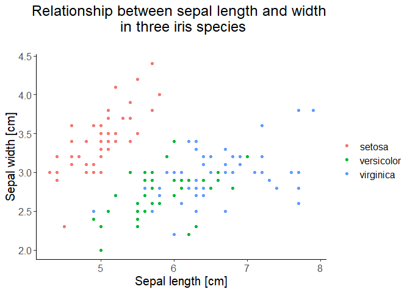
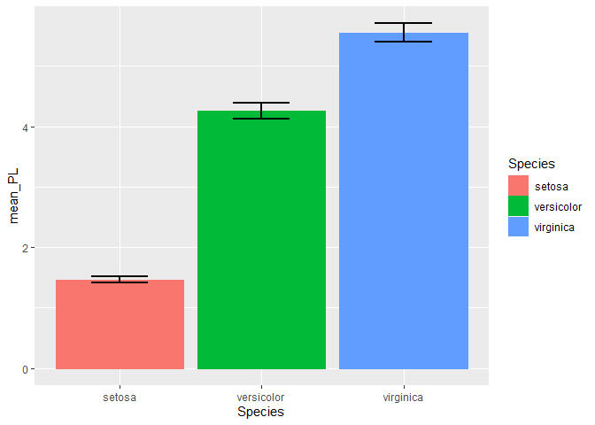
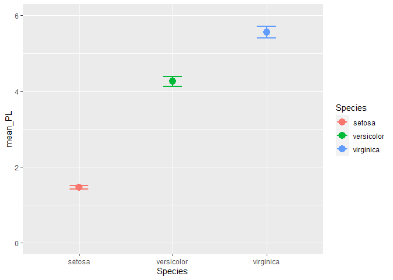
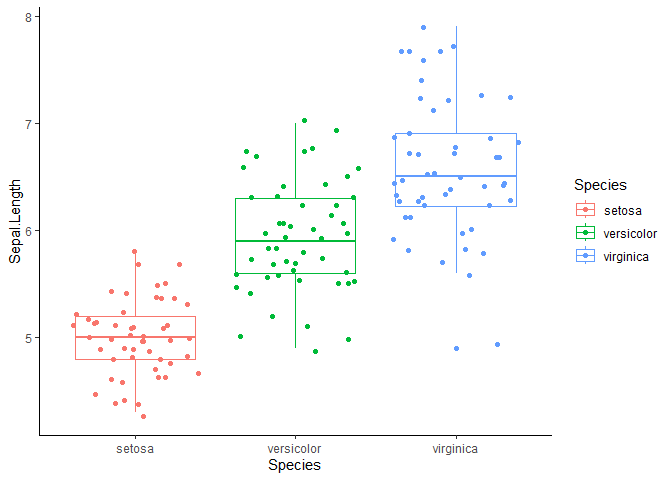
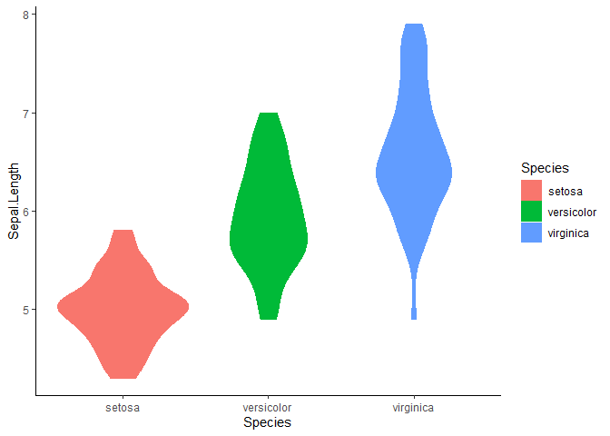
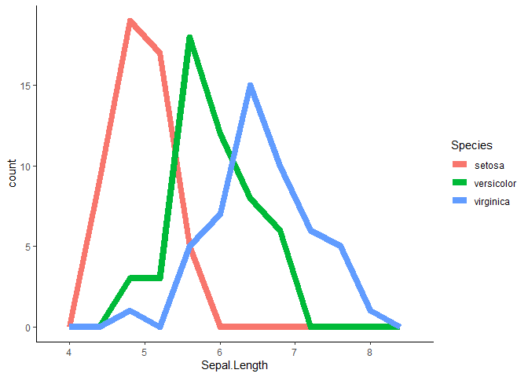
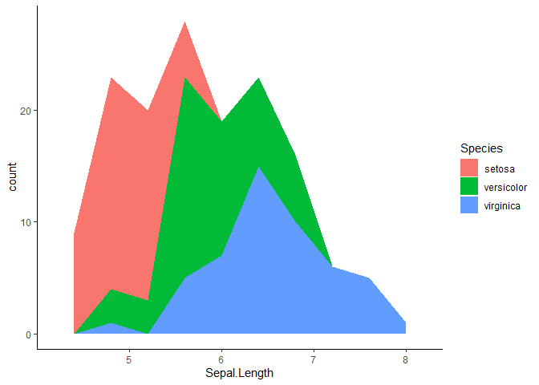
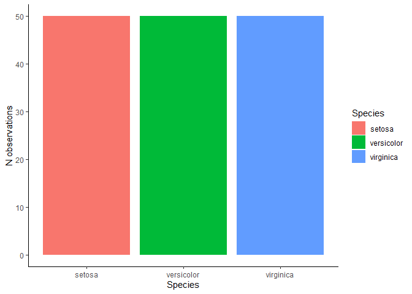
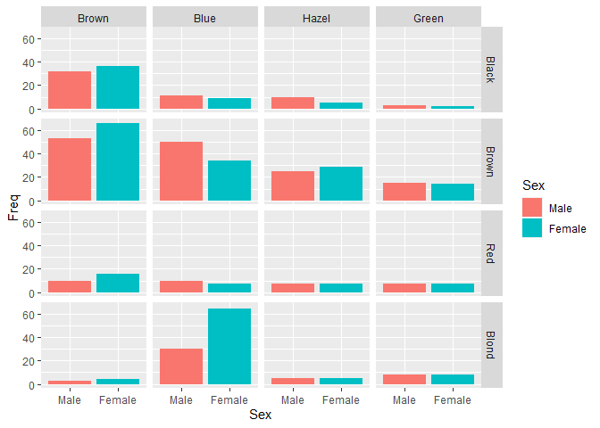

Class 12: Plotting: ggplot2
================
Wiesław Babik
2023-11-28

- [Plotting](#plotting)
  - [Exercise 1](#exercise-1)
- [`ggplot2` and the Grammar of
  Graphics](#ggplot2-and-the-grammar-of-graphics)
  - [Exercise 2](#exercise-2)
- [Scatterplot](#scatterplot)
  - [Plotting area](#plotting-area)
  - [Adding points](#adding-points)
  - [Exercise 3](#exercise-3)
  - [Colour by group](#colour-by-group)
  - [Saving the plot](#saving-the-plot)
  - [Exercise 4](#exercise-4)
  - [Customise](#customise)
  - [Saving multiple plots](#saving-multiple-plots)
  - [Combining multiple plots with
    `patchwork`](#combining-multiple-plots-with-patchwork)
  - [Exercise 5](#exercise-5)
  - [Highlighting specific points](#highlighting-specific-points)
- [Histogram](#histogram)
  - [Exercise 6](#exercise-6)
  - [Exercise 7](#exercise-7)
- [Trend lines and facets](#trend-lines-and-facets)
  - [Trend lines](#trend-lines)
  - [Exercise 8](#exercise-8)
  - [Facets](#facets)
  - [Exercise 9](#exercise-9)
- [Error bars](#error-bars)
  - [Preparing data summaries](#preparing-data-summaries)
  - [Plotting with `geom_errorbar()`](#plotting-with-geom_errorbar)
  - [Exercise 11](#exercise-11)
- [Other plot types](#other-plot-types)
  - [Boxplot, composite and violin
    plot](#boxplot-composite-and-violin-plot)
    - [Exercise 8](#exercise-8-1)
  - [Frequency polygon and area plot](#frequency-polygon-and-area-plot)
  - [Bar plot](#bar-plot)
- [What’s next?](#whats-next)

## Plotting

We’re now well into our R journey, but so far we’ve been seeing our data
only as text and numbers. This is not enough - as the famous
statistician John Tukey said “*There is no excuse for failing to plot
and look*” - you should always plot and visually inspect your data
before starting any serious analysis. In this class we’ll show how to
create and customise several popular plot types. In today’s class we’ll
use the built-in `iris` dataset.

### Exercise 1

Display the `iris` dataset and produce its summary.

## `ggplot2` and the Grammar of Graphics

`ggplot2` is probably the most popular package for creating graphs in R.
It’s based on the concept of the Grammar of Graphics (hence `gg` in the
package name) which aims at introducing a coherent system for describing
and implementing any kind of plot. For our pragmatic introduction it’s
enough to say that the process of creating a graph using `ggplot2`
consists of:

- specifying data that will be plotted,
- mapping variables of the data to the **aesthetics**, that is the
  visual properties, such as coordinates, colours, types of markers
  (circles, squares etc.),
- adding various graphical layers representing your data and,
- specifying the appearance of non-data elements of your plot (titles,
  labels, axes etc.).

### Exercise 2

Load `ggplot2` package or the entire `tidyverse` package suite
(`ggplot2` is a part of `tidyverse`)

## Scatterplot

Scatterplot is one of the most common types of plots, we use it when we
are interested in a relationship between two continuous (or, sometimes,
categorical) variables. To make a meaningful scatterplot your both
variables must be numeric. We’ll examine the relationship between sepal
length and sepal width.

### Plotting area

The main plotting function is `ggplot()`, not, as the name of the
package could suggest, `ggplot2()`. We supply the name of the dataset
and map two variables to `x` and `y` aesthetics.

``` r
ggplot(data = iris, mapping = aes(x = Sepal.Length, y = Sepal.Width, colour = Species))
```

<!-- -->

### Adding points

We see the plot, with both axes scaled according to the ranges of the
two variables to be plotted, but there’s nothing else on the plot. It’s
because we have to add the visual layer(s) representing the data, which
are called **geoms**. Not every geom is appropriate for displaying every
type of data, you can find the complete list of geoms
[here](https://ggplot2.tidyverse.org/reference/index.html). For
scatterplot we’ll use `geom_point()`. Also, we can omit `data =` and
`mapping =` when we keep the order of the arguments.

``` r
ggplot(iris, aes(x = Sepal.Length, y = Sepal.Width)) + 
  geom_point()
```

<!-- -->

> ### Points, colours and backgrounds
>
> In ggplot2 you can use many different point shapes, which you set
> using `pch` parameter within `geom_point()`. The available point
> shapes with their corresponding numerical values are:
>
> .
>
> Note, that `pch` from 1 to 14 have only coloured outlines while the
> inside is empty, 15-20 are solid symbols, while 21 to 25 have the
> outline and filling (background), which can have different colours.
> You set the colour of symbols 0-20 and outline colour of symbols 21-25
> using `colour`/`color` aesthetic, while fill of symbols 21-25 can be
> set using `fill` aesthetic. Both `colour` and `fill` take colour
> names, such as `"red"` or `"darkblue"` or `"gray30"` as values, and
> the list of colours accesible by name can be found
> [here](http://www.stat.columbia.edu/~tzheng/files/Rcolor.pdf). R
> understands names of 657(!) colours, and all their names can be lister
> with `colours()` function (alternative spelling `colors()`). Note that
> colours can be also specified using various schemes of numerical
> values, but this is beyond the scope of our course (look, e.g.,
> [here](http://www.sthda.com/english/wiki/colors-in-r)). Size of the
> symbol can be adjusted using `size` parameter within `geom_point()`.

Now, we can use another type of the marker, and change its size.

``` r
ggplot(data = iris, aes(x = Sepal.Length, y = Sepal.Width)) + 
  geom_point(pch = 10, size = 3)
```

<!-- -->

### Exercise 3

Change plotting symbols to diamonds of the size 5, with blue outline and
pink fill.

### Colour by group

Before we start prettyfying our plot, let’s mark each species with a
distinct colour. It’s very simple and natural in `ggplot2()` - we just
add colour aesthetics and map the variable `Species` to it.

``` r
ggplot(iris, aes(x = Sepal.Length, y = Sepal.Width, colour = Species)) + 
  geom_point()
```

<!-- -->

In addition to colouring points according to species, `ggplot2`
automatically added a legend.

### Saving the plot

Probably the easiest way to save the plot created with `ggplot2` to file
is to use `ggsave()`. By default this function saves the last plot. Its
only required parameter is the file name. `ggsave()` automatically
recognises the intended file format using the extension you provide with
the file name, but you can always be explicit using the `device`
parameter. The size and resolution fo the images can be set using
`width`, `height`, `units` and `dpi` parameters. Consult `ggsave()` help
page to check for other parameters.

So, we’re saving the last plot as .pdf file

``` r
ggsave("My_first_plot.pdf")
```

    ## Saving 7 x 5 in image

### Exercise 4

Try to recreate the plot below, note that a particular variable can be
assigned to two aesthetics, here both `colour` and `shape`

<!-- -->

### Customise

Now, we can complete our plot by customising its appearance, adding and
adjusting labels. We’ll start with adding a title and updating the axis
labels.

``` r
ggplot(iris, aes(x = Sepal.Length, y = Sepal.Width, colour = Species)) + 
  geom_point() +
  labs(title = "Relationship between sepal length and width \n in three iris species\n",
       x = "Sepal length [cm]",
       y = "Sepal width [cm]")
```

<!-- -->

It’s informative now, but we’d like to make it look nicer. This is what
**theme** is for - it allows to control how/whether the non-data
elements of the plot are displayed. We’d like to make all the text
bigger, center the plot title, and remove the legend title, while
leaving the guides linking the colours with species.

``` r
ggplot(iris, aes(x = Sepal.Length, y = Sepal.Width, colour = Species)) + 
  geom_point() +
  labs(title = "Relationship between sepal length and width \n in three iris species\n",
       x = "Sepal length [cm]",
       y = "Sepal width [cm]") +
  theme(text = element_text(size = 15),
        legend.title = element_blank(),
        plot.title = element_text(hjust = 0.5))
```

<!-- -->

In `ggplot2` there are several predefined **themes** that allow to
change multiple aspects of the graph, their complete list is
[here](https://ggplot2.tidyverse.org/reference/ggtheme.html). Let’s use
a theme that doesn’t have the grey background.

``` r
ggplot(iris, aes(x = Sepal.Length, y = Sepal.Width, colour = Species)) + 
  geom_point() +
  labs(title = "Relationship between sepal length and width \n in three iris species\n",
       x = "Sepal length [cm]",
       y = "Sepal width [cm]") +
  theme(text = element_text(size = 15),
        legend.title = element_blank(),
        plot.title = element_text(hjust = 0.5)) +
  theme_classic()
```

<!-- -->

Ok, so we got rid of the grey background, but the tweaks we previously
applied to the plot and legend titles are lost! The reason is that our
adjustments to **theme** have been overwritten by applying a predefined
theme - we should apply `theme_classic` first and then `theme()` to
customise some of its elements

``` r
ggplot(iris, aes(x = Sepal.Length, y = Sepal.Width, colour = Species)) + 
  geom_point() +
  labs(title = "Relationship between sepal length and width \n in three iris species\n",
       x = "Sepal length [cm]",
       y = "Sepal width [cm]") +
  theme_classic() + 
  theme(text = element_text(size = 15),
        legend.title = element_blank(),
        plot.title = element_text(hjust = 0.5))
```

<!-- -->

So far, we were adding or modifying plot elements by copying and pasting
code, which is not convenient. We can also assign plot to a variable and
use this variable when adding elements.

``` r
p <- ggplot(iris, aes(x = Sepal.Length, y = Sepal.Width, colour = Species))

p1 <- p + geom_point()

p2 <- p1 +  labs(title = "Relationship between sepal length and width \n in three iris species\n",
       x = "Sepal length [cm]",
       y = "Sepal width [cm]") +
    theme_classic() + 
    theme(text = element_text(size = 15),
        legend.title = element_blank(),
        plot.title = element_text(hjust = 0.5))
```

Note, that when you assign plot to a variable, it will not be drawn, you
have to invoke the variable explicitly for the plot to appear.

``` r
p2
```

### Saving multiple plots

Another way to save plot or plots in any of the available formats, you
have to use a **graphical device**. There are many of them, for a list
see
[here](https://stat.ethz.ch/R-manual/R-devel/library/grDevices/html/Devices.html).
The most popular vector formats are `pdf`, `svg` and `postscript`, while
commonly used bitmap format include `png`, `jpeg` and `tiff`. To save
graphs `p`, `p1`, `p2` as `pdf` use:

``` r
pdf(file = "my_several_scatterplots.pdf")
p
p1
p2
dev.off()
```

    ## png 
    ##   2

### Combining multiple plots with `patchwork`

The package `patchwork` is an extremely simple solution for combining
several plots on a single page

### Exercise 5

Load (or install, if needed, and then load `patchwork` package).

To combine multiple plots in patchwork, in a single row, just add them
together with `+`

``` r
p + p1 + p2
```

<!-- -->

And to put them all in a single column, use the `/` operator

``` r
p / p1 / p2
```

<!-- -->

### Highlighting specific points

It’s possible to use different datasets with different geoms, or even
use the same geom more than once, each time with different data. It’s a
very powerful way of annotating or highlighting any data points you
want. We’ll illustrate it by marking, in our Sepal length vs. Sepal
width plots, the samples from each species which have the maximum Petal
width. We’ll start by creating a separate data frame containing for each
species the plant with the maximum Petal width

``` r
max_petal <- iris %>% group_by(Species) %>% slice_max(order_by = Petal.Length)
max_petal
```

    ## # A tibble: 4 × 5
    ## # Groups:   Species [3]
    ##   Sepal.Length Sepal.Width Petal.Length Petal.Width Species   
    ##          <dbl>       <dbl>        <dbl>       <dbl> <fct>     
    ## 1          4.8         3.4          1.9         0.2 setosa    
    ## 2          5.1         3.8          1.9         0.4 setosa    
    ## 3          6           2.7          5.1         1.6 versicolor
    ## 4          7.7         2.6          6.9         2.3 virginica

Note, that although we have only three species, the resulting data frame
contains four rows because in *I. setosa* two plants had the same
maximum Petal length. If we want to avoid this, we can use the
`slice_max()` with the option `with_ties = FALSE`, then one of the two
plants will be picked randomly.

Now, we can add this information to our plot.

``` r
p3 <- p2 + geom_point(data = max_petal, pch = 1, size = 4, colour = "red", stroke = 1)
p3
```

<!-- -->

We have used `geom_point()` twice, first to plot all points, and then to
highlight the points which had the longest petals

## Histogram

Let’s now make a histogram of Sepal Length

``` r
ggplot(iris, aes(x = Sepal.Length)) + 
  geom_histogram()
```

    ## `stat_bin()` using `bins = 30`. Pick better value with `binwidth`.

<!-- -->

It looks like there are too many bins (the default is 30), let’s reduce
their number to 10. It’d also be nice to to show each species with
different colour.

``` r
ggplot(iris, aes(x = Sepal.Length, colour = Species)) + 
  geom_histogram(bins = 10)
```

<!-- -->

Still not great. The bars from different species overlap each other,
while only the outlines are coloured according to species. To show the
bars for each species next to each other we adjust their position with
`position = "dodge"`, while we use the `fill` aesthetics to colour each
bar according to species (it’s because bars have both colour and fill
attributes, referring to the border and inside of the bar,
respectively).

``` r
ggplot(iris, aes(x = Sepal.Length, fill = Species)) + 
  geom_histogram(bins = 10, position = "dodge")
```

<!-- -->

### Exercise 6

Update and customise the histogram to make its appearance similar to the
final form of the scatterplot above. Save it to a .pdf file.

### Exercise 7

Consult help for `geom_histogram()` and make a histogram with horizontal
bars.

<!-- -->

## Trend lines and facets

### Trend lines

When interpreting scatterplots, it’s often useful to have something more
objective than visual assessment of the cloud of points. We can fit some
line describing a trend in the data. This can be easily done in
`ggplot2`using `geom_smooth()` function.

``` r
ggplot(iris, aes(x = Sepal.Length, y = Sepal.Width, colour = Species)) + 
  geom_point() +
  geom_smooth() +
  labs(title = "Relationship between sepal length and width \n in three iris species\n",
       x = "Sepal length [cm]",
       y = "Sepal width [cm]") +
  theme_classic() + 
  theme(text = element_text(size = 15),
        legend.title = element_blank(),
        plot.title = element_text(hjust = 0.5))
```

    ## `geom_smooth()` using method = 'loess' and formula = 'y ~ x'

<!-- -->

It’s pretty smart, as the trend lines were fitted for each species
separately. These are, however, not straight lines we could expect from
earlier experience with, e.g., Excel. It’s because the default smoothing
method `"loess"` is a kind of moving regression. We’d like to have
simple linear regression lines and we’d like to remove grey bands
indicating confidence intervals around the regression lines.

``` r
ggplot(iris, aes(x = Sepal.Length, y = Sepal.Width, colour = Species)) + 
  geom_point() +
  labs(title = "Relationship between sepal length and width \n in three iris species\n",
       x = "Sepal length [cm]",
       y = "Sepal width [cm]") +
  geom_smooth(method = "lm", se = FALSE) +
  theme_classic() + 
  theme(text = element_text(size = 15),
        legend.title = element_blank(),
        plot.title = element_text(hjust = 0.5))
```

    ## `geom_smooth()` using formula = 'y ~ x'

<!-- -->

### Exercise 8

Looking at the linear regressions in the plot above, what can we say
about the relative sepal width in each species?

### Facets

Sometimes, especially if your data are complex and involve categorical
variable(s) with multiple categories, it may be useful to examine the
data in the form of an array of scatterplots, one for each level (or
each combination of levels) of the categorical variable(s). Such small
plots within the plot are called **facets**. We’ll illustrate faceting
with `iris` data - in this case using colours to mark species in a
single scatterplot, as we did above, may be sufficient, but still, this
dataset is useful to illustrate faceting and we’ll keep it for
consistency.

``` r
ggplot(iris, aes(x = Sepal.Length, y = Sepal.Width, colour = Species)) + 
  geom_point() +
  labs(title = "Relationship between sepal length and width \n in three iris species\n",
       x = "Sepal length [cm]",
       y = "Sepal width [cm]") +
  geom_smooth(method = "lm", se = FALSE) +
  theme_classic() +
  theme(text = element_text(size = 15),
        legend.title = element_blank(),
        plot.title = element_text(hjust = 0.5)) +
  facet_wrap(vars(Species))
```

    ## `geom_smooth()` using formula = 'y ~ x'

<!-- -->

There’s too much white in this plot, perhaps the default theme with the
grey background would work better for facets. Also, the legend is not
need as facet labels do the job. In this case the ranges of both
variables are comparable, so common scales of both variables for all
facets work well. In other cases, however, if the ranges of variables
differ between facets, it may be useful to use facet-specific ranges of
one or both variables. This is controlled by `scales` parameter
(“fixed”, “free”, “free_x”, “free_y”).

``` r
ggplot(iris, aes(x = Sepal.Length, y = Sepal.Width, colour = Species)) + 
  geom_point() +
  labs(title = "Relationship between sepal length and width \n in three iris species\n",
       x = "Sepal length [cm]",
       y = "Sepal width [cm]") +
  geom_smooth(method = "lm", se = FALSE) +
  theme(text = element_text(size = 15),
        legend.position = "none",
        legend.title = element_blank(),
        plot.title = element_text(hjust = 0.5)) +
  facet_wrap(vars(Species), scales = "free")
```

    ## `geom_smooth()` using formula = 'y ~ x'

<!-- -->

### Exercise 9

Modify the code we used to plot the histogram to obtain the plot below:

<!-- -->

## Error bars

When visualising mean values of variables, often we’d like to visualise
also uncertainty associated with the estimate. This can be done by
adding error bars using `geom_errorbar()`.

### Preparing data summaries

We’ll calculate for each species mean Sepal length and their confidence
intervals in a new dataframe. Note that standard error of mean (SEM) is
calculated by dividing standard deviation `sd()` by square root of the
sample size, and confidence intervals are calculated as +- 1.96 \* SEM.

``` r
iris_means <- iris %>% group_by(Species) %>% summarise(mean_PL = mean(Petal.Length),
                                                       SEM_PL = sd(Petal.Length)/sqrt(n()))
```

### Plotting with `geom_errorbar()`

``` r
ggplot(iris_means, aes(x = Species, y = mean_PL, fill = Species, colour = Species)) + 
  geom_col(position = "dodge") + 
  geom_errorbar(aes(x = Species, ymin = mean_PL - 1.96*SEM_PL, ymax = mean_PL + 1.96*SEM_PL), colour = "black")
```

<!-- -->

and let’s make the error bars look nicer

``` r
ggplot(iris_means, aes(x = Species, y = mean_PL, fill = Species, colour = Species)) + 
  geom_col(position = "dodge") + 
  geom_errorbar(aes(x = Species, ymin = mean_PL - 1.96*SEM_PL, ymax = mean_PL + 1.96*SEM_PL), 
                width = 0.4, linewidth = 0.8, colour = "black")
```

<!-- -->

### Exercise 11

Using column/barplots to visualise means is not a good idea. Try to
produce a plot similar to the one below. It’s enough to change one geom,
play around with one aesthetic and adjust axis limits.

<!-- -->

## Other plot types

### Boxplot, composite and violin plot

Often, we want to compare the value of a variable between groups defined
by levels of a categorical variable. Then, boxplot via `geom_boxplot()`
comes handy.

``` r
ggplot(iris, aes(x = Species, y = Sepal.Length, colour = Species)) + 
  geom_boxplot() +
  theme_classic()
```

<!-- -->

#### Exercise 8

Consult help for `geom_boxplot()` to learn what the horizontal line,
box, whiskers and the point correspond for and propose a title for the
plot.

If you have tens, or perhaps a hundred data points, it may be useful to
show them all together with boxplot. To avoid points overlapping each
other, use `geom_jitter()`.

``` r
ggplot(iris, aes(x = Species, y = Sepal.Length, colour = Species)) + 
  geom_boxplot() + geom_jitter() +
  theme_classic()
```

<!-- -->

If your dataset contains many points, you may want to use **violin
plot** to visualise their distribution. Note, that we supplied fill
aesthetics to the geom directly - it’s perfectly legitimate and gives
you more flexibility over the appearance of the plot.

``` r
ggplot(iris, aes(x = Species, y = Sepal.Length, colour = Species)) + 
  geom_violin(aes(fill = Species)) +
  theme_classic()
```

<!-- -->

### Frequency polygon and area plot

Two types of plot serving similar purpose as histogram are **frequency
polygon** and **area plot**. In some situations they may be more
readable than a histogram.

``` r
ggplot(iris, aes(x = Sepal.Length, colour = Species)) + 
  geom_freqpoly(stat = "bin", size = 3, bins = 10) +
  theme_classic()
```

    ## Warning: Using `size` aesthetic for lines was deprecated in ggplot2 3.4.0.
    ## ℹ Please use `linewidth` instead.
    ## This warning is displayed once every 8 hours.
    ## Call `lifecycle::last_lifecycle_warnings()` to see where this warning was
    ## generated.

<!-- -->

Note that frequency polygons don’t have `fill` attribute and we used
`size` to make their lines thicker. If we want colour-filled areas, use
`geom_area()` with an appropriate aesthetics.

``` r
ggplot(iris, aes(x = Sepal.Length, fill = Species)) + 
  geom_area(aes(y = ..count..), stat = "bin", bins = 10) +
  theme_classic()
```

    ## Warning: The dot-dot notation (`..count..`) was deprecated in ggplot2 3.4.0.
    ## ℹ Please use `after_stat(count)` instead.
    ## This warning is displayed once every 8 hours.
    ## Call `lifecycle::last_lifecycle_warnings()` to see where this warning was
    ## generated.

<!-- -->

### Bar plot

The last type of the plot we’ll cover is **bar plot** also known as
**column plot** (used already above). It’s useful if you want to compare
some statistics between groups. The default behaviour of
`geom_barplot()` is to make the height of the bars corresponding to the
number of observations in each group. It’s possible to use also other
summarising functions, such as mean or median, although in such cases
boxplot may be more natural choice.

``` r
ggplot(iris, aes(x = Species, fill = Species)) + geom_bar() + 
  labs(y = "N observations") + theme_classic()
```

<!-- -->

Bar plots may also be used to visualise data which are already
summarised. In such cases use `geom_bar()` with `stat = "identity"` or,
alternatively `geom_col()`. Below, we use built-in dataset HairEyeColor
containing information about counts of combinations of eye and hair
colours in women and men. We start with reading this dataset as data
frame and then use faceted barplots to show differences between both
sexes for each eye and hair colour combination.

``` r
HEC <- as.data.frame(HairEyeColor)
ggplot(HEC, aes(x = Sex, y = Freq, fill = Sex)) + 
  geom_bar(stat = "identity") +  ##geom_col() would work the same
  facet_grid(rows = vars(Hair), cols = vars(Eye))
```

<!-- -->

## What’s next?

Plotting is a big topic and we’ve just scratched the surface here.
Hopefully, we’ve shown enough to pique your interest and prepared you to
explore the topic on your own. You’ll find more in these free online
resources:

- <https://ggplot2-book.org/>
- <http://www.cookbook-r.com/>
- <https://ggplot2.tidyverse.org/index.html>

Remember! Wit a bit of effort you’d be able to produce complete,
publication ready plots in \`ggplot2, without the need of any
post-processing in other graphical programs. It’s definitely work making
such an effort - it will pay off in the near future!
