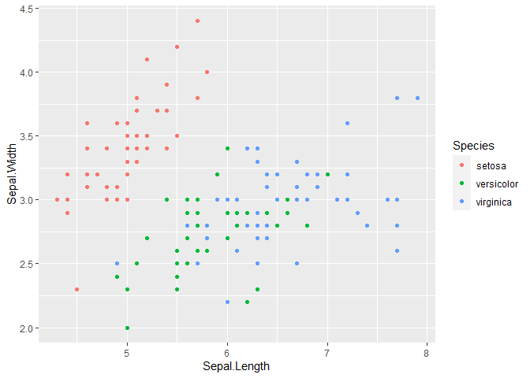
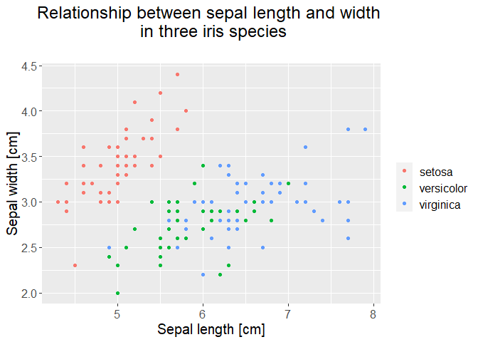
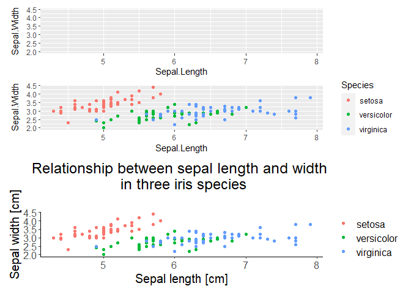
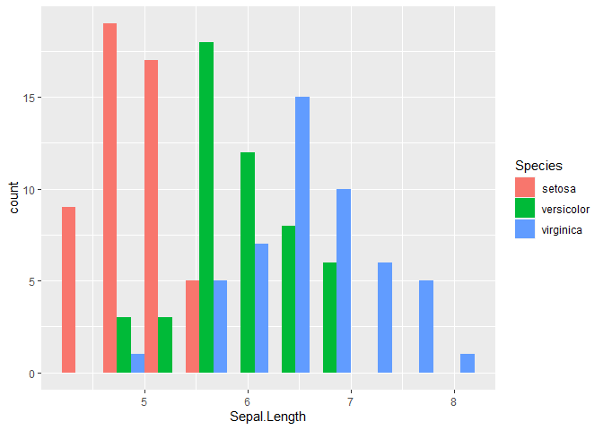
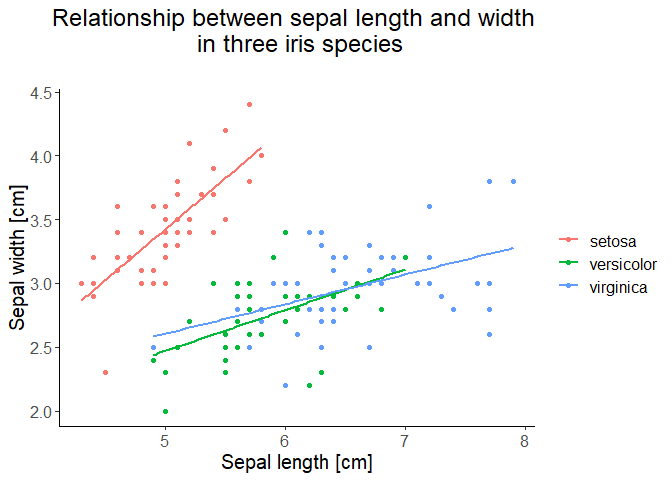

Class 12: Plotting: ggplot2
================
Wiesław Babik
2023-01-03

- <a href="#ggplot2-and-the-grammar-of-graphics"
  id="toc-ggplot2-and-the-grammar-of-graphics"><code>ggplot2</code> and
  the Grammar of Graphics</a>
- <a href="#recreating-plots-we-did-in-base-r"
  id="toc-recreating-plots-we-did-in-base-r">Recreating plots we did in
  base R</a>
  - <a href="#exercise-1" id="toc-exercise-1">Exercise 1</a>
  - <a href="#scatterplot" id="toc-scatterplot">Scatterplot</a>
    - <a href="#exercise-2" id="toc-exercise-2">Exercise 2</a>
    - <a href="#exercise-3" id="toc-exercise-3">Exercise 3</a>
  - <a href="#histogram" id="toc-histogram">Histogram</a>
    - <a href="#exercise-4" id="toc-exercise-4">Exercise 4</a>
    - <a href="#exercise-5" id="toc-exercise-5">Exercise 5</a>
- <a href="#trend-lines-and-facets" id="toc-trend-lines-and-facets">Trend
  lines and facets</a>
  - <a href="#trend-lines" id="toc-trend-lines">Trend lines</a>
    - <a href="#exercise-6" id="toc-exercise-6">Exercise 6</a>
  - <a href="#facets" id="toc-facets">Facets</a>
    - <a href="#exercise-7" id="toc-exercise-7">Exercise 7</a>
- <a href="#other-plot-types" id="toc-other-plot-types">Other plot
  types</a>
  - <a href="#boxplot-composite-and-violin-plot"
    id="toc-boxplot-composite-and-violin-plot">Boxplot, composite and violin
    plot</a>
    - <a href="#exercise-8" id="toc-exercise-8">Exercise 8</a>
  - <a href="#frequency-polygon-and-area-plot"
    id="toc-frequency-polygon-and-area-plot">Frequency polygon and area
    plot</a>
  - <a href="#bar-plot" id="toc-bar-plot">Bar plot</a>
- <a href="#whats-next" id="toc-whats-next">What’s next?</a>

## `ggplot2` and the Grammar of Graphics

`ggplot2` is probably the most popular package for creating graphs in R.
It’s based on the concept of the Grammar of Graphics (hence `gg` in the
package name) which aims at introducing a coherent system for describing
and implementing any kind of plot. For our pragmatic introduction it’s
enough to say that the process of creating a graph using `ggplot2`
consists of:

- specifying data that will be plotted,
- mapping variables of the data to the **aesthetics**, that is the
  visual properties, such as coordinates, colours, types of markers
  (circles, squares etc.),
- adding various graphical layers representing your data and,
- specifying the appearance of non-data elements of your plot (titles,
  labels, axes etc.).

## Recreating plots we did in base R

We’ll start with showing how to make, using `ggplot2`, the scatterplot
and histogram we previously constructed in base R. You’ll notice that
though exactly the same visual information will be conveyed by base R
and `ggplot2` graphics, their appearance will differ because of
different **theme** defaults used. Of course, it would be possible to
create plots looking exactly the same using both approaches, but this
would require considerable effort.

#### Exercise 1

Load `ggplot2` package or the entire `tidyverse` package suite
(`ggplot2` is a part of `tidyverse`)

### Scatterplot

The main plotting function is `ggplot()`, not, as the name of the
package could suggest, `ggplot2()`. We supply the name of the dataset
and map two variables to `x` and `y` aesthetics.

``` r
ggplot(data = iris, mapping = aes(x = Sepal.Length, y = Sepal.Width, colour = Species))
```

<!-- -->

We see the plot, with both axes scaled according to the ranges of the
two variables to be plotted, but there’s nothing else on the plot. It’s
because we have to add the visual layer(s) representing the data, which
are called **geoms**. Not every geom is appropriate for displaying every
type of data, you can find the complete list of geoms
[here](https://ggplot2.tidyverse.org/reference/index.html). For
scatterplot we’ll use `geom_point()`. Also, we can omit `data =` and
`mapping =` when we keep the order of the arguments.

``` r
ggplot(iris, aes(x = Sepal.Length, y = Sepal.Width)) + 
  geom_point()
```

<!-- -->

Of course, we can use an other type of the marker, and change its size.

``` r
ggplot(data = iris, aes(x = Sepal.Length, y = Sepal.Width)) + 
  geom_point(pch = 10, size = 3)
```

<!-- -->

Before we start prettyfying our plot, let’s mark each species with a
distinct colour. It’s very simple and natural in `ggplot2()` - we just
add colour aesthetics and map the variable `Species` to it.

``` r
ggplot(iris, aes(x = Sepal.Length, y = Sepal.Width, colour = Species)) + 
  geom_point()
```

<!-- -->

In addition to colouring points according to species, `ggplot2`
automatically added a legend.

#### Exercise 2

Try to recreate the plot below, note that a particular variable can be
assigned to two aesthetics, here both `colour` and `shape`

<!-- -->

Now, we can complete our plot by customising its appearance, adding and
adjusting labels. We’ll start with adding a title and updating the axis
labels.

``` r
ggplot(iris, aes(x = Sepal.Length, y = Sepal.Width, colour = Species)) + 
  geom_point() +
  labs(title = "Relationship between sepal length and width \n in three iris species\n",
       x = "Sepal length [cm]",
       y = "Sepal width [cm]")
```

<!-- -->

It’s informative now, but we’d like to make it look nicer. This is what
**theme** is for - it allows to control how/whether the non-data
elements of the plot are displayed. We’d like to make all the text
bigger, center the plot title, and remove the legend title, while
leaving the guides linking the colours with species.

``` r
ggplot(iris, aes(x = Sepal.Length, y = Sepal.Width, colour = Species)) + 
  geom_point() +
  labs(title = "Relationship between sepal length and width \n in three iris species\n",
       x = "Sepal length [cm]",
       y = "Sepal width [cm]") +
  theme(text = element_text(size = 15),
        legend.title = element_blank(),
        plot.title = element_text(hjust = 0.5))
```

<!-- -->

In `ggplot2` there are several predefined **themes** that allow to
change multiple aspects of the graph, their complete list is
[here](https://ggplot2.tidyverse.org/reference/ggtheme.html). Let’s use
a theme that doesn’t have the grey background.

``` r
ggplot(iris, aes(x = Sepal.Length, y = Sepal.Width, colour = Species)) + 
  geom_point() +
  labs(title = "Relationship between sepal length and width \n in three iris species\n",
       x = "Sepal length [cm]",
       y = "Sepal width [cm]") +
  theme(text = element_text(size = 15),
        legend.title = element_blank(),
        plot.title = element_text(hjust = 0.5)) +
  theme_classic()
```

<!-- -->

Ok, so we got rid of the grey background, but the tweaks we previously
applied to the plot and legend titles are lost! The reason is that our
adjustments to **theme** have been overwritten by applying a predefined
theme - we should apply `theme_classic` first and then `theme()` to
customise some of its elements

``` r
ggplot(iris, aes(x = Sepal.Length, y = Sepal.Width, colour = Species)) + 
  geom_point() +
  labs(title = "Relationship between sepal length and width \n in three iris species\n",
       x = "Sepal length [cm]",
       y = "Sepal width [cm]") +
  theme_classic() + 
  theme(text = element_text(size = 15),
        legend.title = element_blank(),
        plot.title = element_text(hjust = 0.5))
```

<!-- -->

So far, we were adding or modifying plot elements by copying an pasting
code, which is not convenient. We can also assign plot to a variable and
use this variable when adding elements.

``` r
p <- ggplot(iris, aes(x = Sepal.Length, y = Sepal.Width, colour = Species))

p1 <- p + geom_point()

p2 <- p1 +  labs(title = "Relationship between sepal length and width \n in three iris species\n",
       x = "Sepal length [cm]",
       y = "Sepal width [cm]")
```

Note, that when you assign plot to a variable, it will not be drawn, you
have to invoke the variable explicitly for the plot to appear.

``` r
p2
```

Ok, so we’re done with the scatterplot an we can move on to the
histogram, but before

#### Exercise 3

Print the last four plots to a single pdf file. Build the plots by
assigning to variables and adding consecutive elements with `+`.

### Histogram

Let’s now make a histogram of Sepal Length

``` r
ggplot(iris, aes(x = Sepal.Length)) + 
  geom_histogram()
```

    ## `stat_bin()` using `bins = 30`. Pick better value with `binwidth`.

<!-- -->

It looks like there are too many bins (the default is 30), let’s reduce
their number to 10. It’d also be nice to to show each species with
different colour.

``` r
ggplot(iris, aes(x = Sepal.Length, colour = Species)) + 
  geom_histogram(bins = 10)
```

<!-- -->

Still not great. The bars from different species overlap each other,
while only the outlines are coloured according to species. To show the
bars for each species next to each other we adjust their position with
`position = "dodge"`, while we use the `fill` aesthetics to colour each
bar according to species (it’s because bars have both colour and fill
attributes, referring to the border and inside of the bar,
respectively).

``` r
ggplot(iris, aes(x = Sepal.Length, fill = Species)) + 
  geom_histogram(bins = 10, position = "dodge")
```

<!-- -->

#### Exercise 4

Update and customise the histogram to make its appearance similar to the
final form of the scatterplot above. Save it to a .pdf file.

#### Exercise 5

Consult help for `geom_histogram()` and make a histogram with horizontal
bars.

<!-- -->

## Trend lines and facets

### Trend lines

Let’s now extend our plots beyond what we did using base R graphics.
When interpreting scatterplots, it’s often useful to have something more
objective than visual assessment of the cloud of points. We can fit some
line describing a trend in the data. This can be easily done in
`ggplot2`using `geom_smooth()` function.

``` r
ggplot(iris, aes(x = Sepal.Length, y = Sepal.Width, colour = Species)) + 
  geom_point() +
  geom_smooth() +
  labs(title = "Relationship between sepal length and width \n in three iris species\n",
       x = "Sepal length [cm]",
       y = "Sepal width [cm]") +
  theme_classic() + 
  theme(text = element_text(size = 15),
        legend.title = element_blank(),
        plot.title = element_text(hjust = 0.5))
```

    ## `geom_smooth()` using method = 'loess' and formula 'y ~ x'

<!-- -->

It’s pretty smart, as the trend lines were fitted for each species
separately. These are, however, not straight lines we could expect from
earlier experience with, e.g., Excel. It’s because the default smoothing
method `"loess"` is a kind of moving regression. We’d like to have
simple linear regression lines and we’d like to remove grey bands
indicating confidence intervals around the regression lines.

``` r
ggplot(iris, aes(x = Sepal.Length, y = Sepal.Width, colour = Species)) + 
  geom_point() +
  labs(title = "Relationship between sepal length and width \n in three iris species\n",
       x = "Sepal length [cm]",
       y = "Sepal width [cm]") +
  geom_smooth(method = "lm", se = FALSE) +
  theme_classic() + 
  theme(text = element_text(size = 15),
        legend.title = element_blank(),
        plot.title = element_text(hjust = 0.5))
```

    ## `geom_smooth()` using formula 'y ~ x'

<!-- -->

#### Exercise 6

Looking at the linear regressions in the plot above, what can we say
about the relative sepal width in each species?

### Facets

Sometimes, especially if your data are complex and involve categorical
variable(s) with multiple categories, it may be useful to examine the
data in the form of an array of scatterplots, one for each level (or
each combination of levels) of the categorical variable(s). Such small
plots within the plot are called **facets**. We’ll illustrate faceting
with `iris` data - in this case using colours to mark species in a
single scatterplot, as we did above, may be sufficient, but still, this
dataset is useful to illustrate faceting and we’ll keep it for
consistency.

``` r
ggplot(iris, aes(x = Sepal.Length, y = Sepal.Width, colour = Species)) + 
  geom_point() +
  labs(title = "Relationship between sepal length and width \n in three iris species\n",
       x = "Sepal length [cm]",
       y = "Sepal width [cm]") +
  geom_smooth(method = "lm", se = FALSE) +
  theme_classic() +
  theme(text = element_text(size = 15),
        legend.title = element_blank(),
        plot.title = element_text(hjust = 0.5)) +
  facet_wrap(vars(Species))
```

    ## `geom_smooth()` using formula 'y ~ x'

<!-- -->

There’s too much white in this plot, perhaps the default theme with the
grey background would work better for facets. Also, the legend is not
need as facet labels do the job. In this case the ranges of both
variables are comparable, so common scales of both variables for all
facets work well. In other cases, however, if the ranges of variables
differ between facets, it may be useful to use facet-specific ranges of
one or both variables. This is controlled by `scales` parameter
(“fixed”, “free”, “free_x”, “free_y”).

``` r
ggplot(iris, aes(x = Sepal.Length, y = Sepal.Width, colour = Species)) + 
  geom_point() +
  labs(title = "Relationship between sepal length and width \n in three iris species\n",
       x = "Sepal length [cm]",
       y = "Sepal width [cm]") +
  geom_smooth(method = "lm", se = FALSE) +
  theme(text = element_text(size = 15),
        legend.position = "none",
        legend.title = element_blank(),
        plot.title = element_text(hjust = 0.5)) +
  facet_wrap(vars(Species), scales = "free")
```

    ## `geom_smooth()` using formula 'y ~ x'

<!-- -->

#### Exercise 7

Modify the code we used to plot the histogram to obtain the plot below:

<!-- -->

## Other plot types

### Boxplot, composite and violin plot

Often, we want to compare the value of a variable between groups defined
by levels of a categorical variable. Then, boxplot via `geom_boxplot()`
comes handy.

``` r
ggplot(iris, aes(x = Species, y = Sepal.Length, colour = Species)) + 
  geom_boxplot() +
  theme_classic()
```

<!-- -->

#### Exercise 8

Consult help for `geom_boxplot()` to learn what the horizontal line,
box, whiskers and the point correspond for and propose a title for the
plot.

If you have tens, or perhaps a hundred data points, it may be useful to
show them all together with boxplot. To avoid points overlapping each
other, use `geom_jitter()`.

``` r
ggplot(iris, aes(x = Species, y = Sepal.Length, colour = Species)) + 
  geom_boxplot() + geom_jitter() +
  theme_classic()
```

<!-- -->

If your dataset contains many points, you may want to use **violin
plot** to visualise their distribution. Note, that we supplied fill
aesthetics to the geom directly - it’s perfectly legitimate and gives
you more flexibility over the appearance of the plot.

``` r
ggplot(iris, aes(x = Species, y = Sepal.Length, colour = Species)) + 
  geom_violin(aes(fill = Species)) +
  theme_classic()
```

<!-- -->

### Frequency polygon and area plot

Two types of plot serving similar purpose as histogram are **frequency
polygon** and **area plot**. In some situations they may be more
readable than a histogram.

``` r
ggplot(iris, aes(x = Sepal.Length, colour = Species)) + 
  geom_freqpoly(stat = "bin", size = 3, bins = 10) +
  theme_classic()
```

<!-- -->

Note that frequency polygons don’t have `fill` attribute and we used
`size` to make their lines thicker. If we want colour-filled areas, use
`geom_area()` with an appropriate aesthetics.

``` r
ggplot(iris, aes(x = Sepal.Length, fill = Species)) + 
  geom_area(aes(y = ..count..), stat = "bin", bins = 10) +
  theme_classic()
```

<!-- -->

### Bar plot

The last type of the plot we’ll cover is **bar plot** also known as
**column plot**. It’s useful if you want to compare some statistics
between groups. The default behaviour of `geom_barplot()` is to make the
height of the bars corresponding to the number of observations in each
group. It’s possible to use also other summarising functions, such as
mean or median, although in such cases boxplot may be more natural
choice.

``` r
ggplot(iris, aes(x = Species, fill = Species)) + geom_bar() + 
  labs(y = "N observations") + theme_classic()
```

<!-- -->

Bar plots may also be used to visualise data which are already
summarised. In such cases use `geom_bar()` with `stat = "identity"` or,
alternatively `geom_col()`. Below, we use built-in dataset HairEyeColor
containing information about counts of combinations of eye and hair
colours in women and men. We start with reading this dataset as data
frame and then use faceted barplots to show differences between both
sexes for each eye and hair colour combination.

``` r
HEC <- as.data.frame(HairEyeColor)
ggplot(HEC, aes(x = Sex, y = Freq, fill = Sex)) + 
  geom_bar(stat = "identity") +  ##geom_col() would work the same
  facet_grid(rows = vars(Hair), cols = vars(Eye))
```

<!-- -->

## What’s next?

Plotting is a big topic and we’ve just scratched the surface here.
Hopefully, we’ve shown enough to pique your interest and prepared you to
explore the topic on your own. You’ll find more in these free online
resources:

- <https://ggplot2-book.org/>
- <http://www.cookbook-r.com/>
- <https://ggplot2.tidyverse.org/index.html>

Remember! Wit a bit of effort you’d be able to produce complete,
publication ready plots in \`ggplot2, without the need of any
post-processing in other graphical programs. It’s definitely work making
such an effort - it will pay off in the near future!
