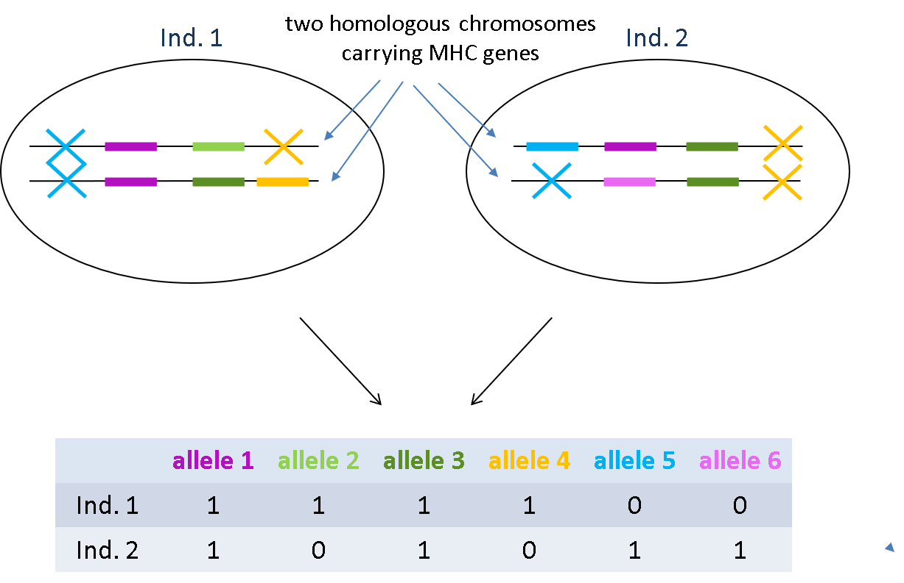

Class 13: Practical dplyr
================
Tomasz Gaczorek & Wiesław Babik
2022-07-12

-   [Step by step instructions](#step-by-step-instructions)
-   [Puting the code together](#puting-the-code-together)

## Step by step instructions

In this class we’ll illustrate the practical use of `dplyr` with a real
life example. Our task will be to summarize data on MHC class I
genotypes from many populations of several *Triturus* newt species.
These genes are duplicated (with different number of genes in different
individuals) and highly polymorphic, so each individual has several
alleles, and the total number of alleles in a species go into
hundreds.  
The picture below explains how the situation seen in the genome
translates into the data we have. 

We will calculate:

-   For each population:
    -   number of analysed individuals (`n_ind`)
    -   total number of MHC alleles (`n_all`)
    -   mean number of MHC alleles per individual (`mean_n_all_ind`)
-   For each species you will calculate the same three summaries and
    additionally also:
    -   number of sampled populations (`n_pop`)

We’ll use the names indicated above as column names of your final result
data frame.

-   **Download data**  
    [Here](https://www.dropbox.com/sh/6s60oyt4snc8fgj/AAAyR9wv3t9hWUah2bq_aNtwa?dl)
    is the folder with the data we will use. Please download the files
    to your computer. All files are encoded in UTF-8. Have a look at the
    content of the files in Notepad++:

    -   `genotypes.txt` - tab-delimited file, 1st row contains column
        names, the remaining rows contain individual IDs and genotypes
        encoded as presence (`1`) or absence (`0`) of each allele.
        Allele names are provided in the 1st row.
    -   `ID_locality_species.txt`- tab-delimited file containing
        individual IDs (as in `genotypes.txt` but more), locality name,
        and species designation. There is also an additional column
        `transctiptome` that we will not use today. Note that locality names
        contain characters outside the standard Latin character set!
    -   `localities.txt`- tab-delimited file containing various
        information about localities. We’ll need only a subset of
        localities and a subset of columns.

    Organisation of these data into the three files emphasizes the
    concepts we learned during this course:

    -   genotype file contains only information about individual IDs and
        genotypes.
    -   further information about each individual is contained in
        another file, and can be linked with genotypes when needed using
        the column `ID` which is shared between the files.
    -   another file contains information about localities, which can be
        linked with information about individuals using the shared
        `locality` column.
    -   `ID_locality_species.txt` and `localities.txt` contain more rows
        and columns than needed. This is not a problem, because we will
        extract only the information we need from these files.

-   **Set up new project in RStudio**  
    Within the project folder create new directory named `data`. Copy
    the three previously downloaded files to `data`

-   **Create new R script**  
    Make sure it’s in you project folder (NOT in `data`). In this script
    you’ll save all the commands we’ll use below.

-   **Load `tidyverse`**

``` r
library(tidyverse)
```

    ## Warning: pakiet 'ggplot2' został zbudowany w wersji R 4.1.3

    ## Warning: pakiet 'tibble' został zbudowany w wersji R 4.1.3

    ## Warning: pakiet 'tidyr' został zbudowany w wersji R 4.1.3

    ## Warning: pakiet 'dplyr' został zbudowany w wersji R 4.1.3

We’re loading the entire `tidyverse` collection, because we’ll need some
functions that are in packages other than `dplyr`

-   **Read genotypes**

``` r
gen <- read.table("data/genotypes.txt", header = TRUE, sep = "\t", encoding = "UTF-8")
head(gen[,1:10])
```

    ##      ID i_0003 i_0005 i_0010 i_0008 i_0024 i_0004 i_0007 i_0001 i_0017
    ## 1 13155      0      0      0      0      0      0      0      1      0
    ## 2 13156      0      0      0      0      0      0      0      1      0
    ## 3 13157      0      0      0      0      0      0      0      1      0
    ## 4 13163      0      0      0      0      0      0      0      1      0
    ## 5 13164      0      0      0      0      0      0      0      1      0
    ## 6 13170      0      0      0      0      0      0      0      1      0

We used several options to modify the default behaviour or
`read.table()`:

-   column names were taken from the 1st row,

-   columns are separated by tabs

-   text is encoded as UTF-8

-   **Check whether any individual IDs are duplicated**

``` r
nrow(gen)
```

    ## [1] 348

``` r
gen %>% select(ID) %>% distinct() %>% nrow()
```

    ## [1] 348

Here we counted the number of rows in the original dataframe and the
dataframe containing only unique IDs

-   **Filter out missing data**  
    The way genotypes were obtained ensures that if information for an
    individual is missing for any allele, it’s actually missing for all.
    So it’s enough to filter out rows that contain `NA` for the first
    allele.

``` r
gen_noNA <- gen %>% filter(!is.na(i_0003))
```

Note that we used a dedicated function `is.na()` to identify `NA`
values.

-   **Read information about each individual’s locality and species**  
    We’ll need only two columns, so we drop `transcriptome` on the way

``` r
ID_info <- read.table("data/ID_locality_species.txt", header = TRUE, sep = "\t", encoding = "UTF-8") %>% 
  select(-transcriptome)
head(ID_info)
```

    ##      ID    locality     species
    ## 1 14465 Mollafeneri  anatolicus
    ## 2 14466 Mollafeneri  anatolicus
    ## 3 14467     Kethüda  anatolicus
    ## 4 14468 Fushë-Krujë macedonicus
    ## 5 14469 Fushë-Krujë macedonicus
    ## 6 14470 Fushë-Krujë macedonicus

-   **Read information about localities**  
    We’ll need just the locality name, country and geographic
    coordinates, so we select only these four columns:

``` r
localities <- read.table("data/localities.txt", header = TRUE, sep = "\t", encoding = "UTF-8") %>% 
  select(locality, country, latitude, longitude)
head(localities)
```

    ##        locality  country latitude longitude
    ## 1   Abanta Gölu   Turkey   40.612    31.288
    ## 2     Adapazari   Turkey   40.799    30.440
    ## 3 Aghios Kosmas   Greece   41.084    24.671
    ## 4         Alepu Bulgaria   42.348    27.714
    ## 5   Alexandrovo Bulgaria   42.602    25.099
    ## 6   Alibahadir2   Turkey   41.187    29.205

-   **Reshape the genotype data into the “long” format**  
    In this step we will radically reshape our data, which will simplify
    further tasks. Instead of having each allele as a separate column,
    we’ll collapse these columns into two: i) allele name, ii)
    information about presence (`1`) or absence (`0`) in a given
    individual.  
    So, we take our data frame that looks like this:

``` r
head(gen[,1:20], n = 20)
```

    ##       ID i_0003 i_0005 i_0010 i_0008 i_0024 i_0004 i_0007 i_0001 i_0017 i_0012
    ## 1  13155      0      0      0      0      0      0      0      1      0      0
    ## 2  13156      0      0      0      0      0      0      0      1      0      0
    ## 3  13157      0      0      0      0      0      0      0      1      0      0
    ## 4  13163      0      0      0      0      0      0      0      1      0      0
    ## 5  13164      0      0      0      0      0      0      0      1      0      0
    ## 6  13170      0      0      0      0      0      0      0      1      0      0
    ## 7  13171      0      0      0      0      0      0      0      1      0      1
    ## 8  13174      0      0      0      0      0      0      0      1      0      0
    ## 9  13175      0      0      0      0      0      0      0      1      0      1
    ## 10 13178      0      0      0      0      0      0      0      1      0      0
    ## 11 14465      0      1      1      0      0      0      1      1      1      0
    ## 12 14466      0      0      0      0      0      0      1      0      1      0
    ## 13 14467      0      0      0      0      0      0      1      0      1      0
    ## 14 14468      0      0      0      1      0      0      0      1      0      0
    ## 15 14469      0      0      0      1      0      0      0      1      0      0
    ## 16 14470      0      0      0      1      0      0      0      1      0      0
    ## 17 14471      0      0      0      1      0      0      1      0      0      1
    ## 18 14472      0      0      0      1      0      0      0      1      0      1
    ## 19 14473      0      0      0      1      0      0      1      0      0      1
    ## 20 14474      0      1      1      0      1      0      0      1      0      1
    ##    i_0045 i_0025 i_0036 i_0013 i_0018 i_0033 i_0023 i_0002 i_0048
    ## 1       0      0      0      0      0      0      0      0      0
    ## 2       0      0      0      0      0      0      0      0      0
    ## 3       0      0      0      0      0      0      0      0      0
    ## 4       0      0      0      0      0      0      0      0      0
    ## 5       0      0      0      0      0      0      0      0      0
    ## 6       0      0      0      0      0      0      0      0      0
    ## 7       0      0      0      0      0      0      0      0      0
    ## 8       0      0      0      0      0      0      0      0      0
    ## 9       0      0      0      0      0      0      0      0      0
    ## 10      0      0      0      0      0      0      0      0      0
    ## 11      0      1      0      1      0      1      0      1      0
    ## 12      0      1      0      0      0      1      0      0      0
    ## 13      0      1      0      1      0      0      0      0      0
    ## 14      0      0      0      0      0      0      0      0      0
    ## 15      0      0      0      0      0      0      0      0      0
    ## 16      0      0      0      0      0      0      0      0      0
    ## 17      0      0      0      0      0      0      1      1      1
    ## 18      0      0      0      0      0      0      0      1      0
    ## 19      0      0      0      0      0      0      1      0      1
    ## 20      0      0      1      0      1      0      0      1      0

And reshape it using the following command:

``` r
gen_long <- gen_noNA %>% pivot_longer(-ID, names_to = "allele", values_to = "present_absent")
head(gen_long, n = 20)
```

    ## # A tibble: 20 x 3
    ##       ID allele present_absent
    ##    <int> <chr>           <int>
    ##  1 13155 i_0003              0
    ##  2 13155 i_0005              0
    ##  3 13155 i_0010              0
    ##  4 13155 i_0008              0
    ##  5 13155 i_0024              0
    ##  6 13155 i_0004              0
    ##  7 13155 i_0007              0
    ##  8 13155 i_0001              1
    ##  9 13155 i_0017              0
    ## 10 13155 i_0012              0
    ## 11 13155 i_0045              0
    ## 12 13155 i_0025              0
    ## 13 13155 i_0036              0
    ## 14 13155 i_0013              0
    ## 15 13155 i_0018              0
    ## 16 13155 i_0033              0
    ## 17 13155 i_0023              0
    ## 18 13155 i_0002              0
    ## 19 13155 i_0048              0
    ## 20 13155 i_0027              1

We called `pivot_longer()`, informing the function that we want to
reshape all the columns except `ID`, that names of the columns should go
the new `allele` column, and that values from these columns should go to
the `present_absent` column. Let’s compare the number of rows in the
original and reshaped data frame:

``` r
nrow(gen_noNA)
```

    ## [1] 344

``` r
nrow(gen_long)
```

    ## [1] 379432

In the long format, the information that an individual doesn’t have a
particular allele is not really useful, so we can just get rid of the
rows with (`0`) in `present_absent`. Then, `present_absent` column would
not be informative anymore, so we can drop it:

``` r
gen_long <- gen_long %>% filter(present_absent == 1) %>% select(-present_absent)
nrow(gen_long)
```

    ## [1] 6779

It’s much shorter now!

-   **Add information about populations and species to the genotype
    table**  
    We start by adding information about locality and species:

``` r
gen_long <- gen_long %>% left_join(ID_info, by = "ID")
head(gen_long, n = 15)
```

    ## # A tibble: 15 x 4
    ##       ID allele locality species   
    ##    <int> <chr>  <chr>    <chr>     
    ##  1 13155 i_0001 Ecka     dobrogicus
    ##  2 13155 i_0027 Ecka     dobrogicus
    ##  3 13155 i_0021 Ecka     dobrogicus
    ##  4 13155 i_0039 Ecka     dobrogicus
    ##  5 13155 i_0099 Ecka     dobrogicus
    ##  6 13155 i_0046 Ecka     dobrogicus
    ##  7 13155 i_0147 Ecka     dobrogicus
    ##  8 13155 i_0053 Ecka     dobrogicus
    ##  9 13155 i_0100 Ecka     dobrogicus
    ## 10 13155 i_0095 Ecka     dobrogicus
    ## 11 13155 i_0149 Ecka     dobrogicus
    ## 12 13155 i_0115 Ecka     dobrogicus
    ## 13 13155 i_0151 Ecka     dobrogicus
    ## 14 13155 i_0076 Ecka     dobrogicus
    ## 15 13155 i_0152 Ecka     dobrogicus

Here we used `left_join()` to add columns from `ID_info` data frame to
`gen_long` data frame. Left join means that in the resulting data frame
all rows from the left (i.e., `gen_long`) data frame will be retained,
and only these rows from `ID_info` data frame will be added, which match
a value of `ID` column in any row of `gen_long` data frame. If multiple
rows from `ID_info` match a single row of `gene_long`, the resulting
data frame will have more rows than `gen_long`.

And now you should add information about localities:

``` r

head(gen_long, n = 15)
```

    ## # A tibble: 15 x 7
    ##       ID allele locality species    country latitude longitude
    ##    <int> <chr>  <chr>    <chr>      <chr>      <dbl>     <dbl>
    ##  1 13155 i_0001 Ecka     dobrogicus Serbia      45.3      20.4
    ##  2 13155 i_0027 Ecka     dobrogicus Serbia      45.3      20.4
    ##  3 13155 i_0021 Ecka     dobrogicus Serbia      45.3      20.4
    ##  4 13155 i_0039 Ecka     dobrogicus Serbia      45.3      20.4
    ##  5 13155 i_0099 Ecka     dobrogicus Serbia      45.3      20.4
    ##  6 13155 i_0046 Ecka     dobrogicus Serbia      45.3      20.4
    ##  7 13155 i_0147 Ecka     dobrogicus Serbia      45.3      20.4
    ##  8 13155 i_0053 Ecka     dobrogicus Serbia      45.3      20.4
    ##  9 13155 i_0100 Ecka     dobrogicus Serbia      45.3      20.4
    ## 10 13155 i_0095 Ecka     dobrogicus Serbia      45.3      20.4
    ## 11 13155 i_0149 Ecka     dobrogicus Serbia      45.3      20.4
    ## 12 13155 i_0115 Ecka     dobrogicus Serbia      45.3      20.4
    ## 13 13155 i_0151 Ecka     dobrogicus Serbia      45.3      20.4
    ## 14 13155 i_0076 Ecka     dobrogicus Serbia      45.3      20.4
    ## 15 13155 i_0152 Ecka     dobrogicus Serbia      45.3      20.4

-   **Calculate summaries we want**  
    First, we calculate for each population:
    -   sample size
    -   the number of distinct alleles
    -   mean number of alleles per individual

``` r
pop_sum <- gen_long %>% group_by(locality, species) %>% summarise(n_ind = n_distinct(ID),
                                                                  n_all = n_distinct(allele),
                                                                  mean_n_all_ind = n()/n_ind)
head(pop_sum)
```

    ## # A tibble: 6 x 5
    ## # Groups:   locality [6]
    ##   locality      species      n_ind n_all mean_n_all_ind
    ##   <chr>         <chr>        <int> <int>          <dbl>
    ## 1 Abanta Gölu   anatolicus       2    29           18  
    ## 2 Adapazari     anatolicus       3    36           19.3
    ## 3 Aghios Kosmas ivanbureschi     2    19           16  
    ## 4 Alepu         ivanbureschi     3    32           24  
    ## 5 Alexandrovo   ivanbureschi     2    22           17.5
    ## 6 Alibahadir2   anatolicus       2    32           20.5

`n_distinct()` calculates the number of different values in a data frame
column **within each group**, as defined in `group_by()`  
`n()` counts the number of rows in each group.  
Please stop here to make sure that you understand what and how was
calculated here.

In principle, it’s possible that more than one species occurs in a
locality, let’s check it!

``` r
nrow(pop_sum)
```

    ## [1] 121

``` r
pop_sum %>% distinct(locality) %>% nrow()
```

    ## [1] 121

Next, we calculate the same statistics, but with data grouped just by
species:

``` r
spec_sum <- gen_long %>% group_by(species) %>% summarise(n_ind = n_distinct(ID),
                                                         n_all = n_distinct(allele),
                                                         mean_n_all_ind = n()/n_ind,
                                                         n_pop = n_distinct(locality))
head(spec_sum)
```

    ## # A tibble: 5 x 5
    ##   species      n_ind n_all mean_n_all_ind n_pop
    ##   <chr>        <int> <int>          <dbl> <int>
    ## 1 anatolicus      54   306           19.2    19
    ## 2 cristatus       57   306           20.9    18
    ## 3 dobrogicus      10   108           24.4     2
    ## 4 ivanbureschi   111   316           18.3    41
    ## 5 macedonicus    112   261           20.3    41

Finally we’d like to have a single table with all summaries, so that the species summary is below the list of
populations of each species for the ease of inspection.

-   **Combine the two result data frames into one**

``` r
sum_sum <- pop_sum %>% bind_rows(spec_sum) 
sum_sum
```

    ## # A tibble: 126 x 6
    ## # Groups:   locality [122]
    ##    locality      species      n_ind n_all mean_n_all_ind n_pop
    ##    <chr>         <chr>        <int> <int>          <dbl> <int>
    ##  1 Abanta Gölu   anatolicus       2    29           18      NA
    ##  2 Adapazari     anatolicus       3    36           19.3    NA
    ##  3 Aghios Kosmas ivanbureschi     2    19           16      NA
    ##  4 Alepu         ivanbureschi     3    32           24      NA
    ##  5 Alexandrovo   ivanbureschi     2    22           17.5    NA
    ##  6 Alibahadir2   anatolicus       2    32           20.5    NA
    ##  7 Alistrati     ivanbureschi     2    29           18      NA
    ##  8 Ano Kalliniki macedonicus      2    17           16      NA
    ##  9 Aranđelovac   ivanbureschi     3    25           15      NA
    ## 10 Avdancik      anatolicus       3    37           20.3    NA
    ## # ... with 116 more rows

`bind_rows()` added rows from `spec_sum` to the end of `pop_sum`.
Because the data frames differed in the number of columns, i.e., `n_pop`
was missing from `pop_sum` and `locality` was missing from `spec_sum`,
the columns from both data frames were combined and filled with `NA`
where needed.  
Have a look at the entire data frame in RStudio viewer (`View()`).

Now, we’ll make use of the fact that `NA` values are put at the end of a
column sorted with `arrange()`, to place summary for each species under
the summaries of its populations:

``` r
sum_sum <- sum_sum %>% arrange(species, locality)
sum_sum
```

    ## # A tibble: 126 x 6
    ## # Groups:   locality [122]
    ##    locality    species    n_ind n_all mean_n_all_ind n_pop
    ##    <chr>       <chr>      <int> <int>          <dbl> <int>
    ##  1 Abanta Gölu anatolicus     2    29           18      NA
    ##  2 Adapazari   anatolicus     3    36           19.3    NA
    ##  3 Alibahadir2 anatolicus     2    32           20.5    NA
    ##  4 Avdancik    anatolicus     3    37           20.3    NA
    ##  5 Çakirli     anatolicus     3    33           18      NA
    ##  6 Çibanköy    anatolicus     3    28           16.7    NA
    ##  7 Gölköy      anatolicus     3    25           17      NA
    ##  8 Gürbulak    anatolicus     2    24           17      NA
    ##  9 Hanköy      anatolicus     3    40           19.7    NA
    ## 10 Karakoç     anatolicus     3    42           22.3    NA
    ## # ... with 116 more rows

And we’d like to replace `NA` in the `Locality` column with the
word “Overall”

    ## # A tibble: 126 x 6
    ## # Groups:   locality [122]
    ##    locality    species    n_ind n_all mean_n_all_ind n_pop
    ##    <chr>       <chr>      <int> <int>          <dbl> <int>
    ##  1 Abanta Gölu anatolicus     2    29           18      NA
    ##  2 Adapazari   anatolicus     3    36           19.3    NA
    ##  3 Alibahadir2 anatolicus     2    32           20.5    NA
    ##  4 Avdancik    anatolicus     3    37           20.3    NA
    ##  5 Çakirli     anatolicus     3    33           18      NA
    ##  6 Çibanköy    anatolicus     3    28           16.7    NA
    ##  7 Gölköy      anatolicus     3    25           17      NA
    ##  8 Gürbulak    anatolicus     2    24           17      NA
    ##  9 Hanköy      anatolicus     3    40           19.7    NA
    ## 10 Karakoç     anatolicus     3    42           22.3    NA
    ## # ... with 116 more rows

`ifelse()` is a function that operates on each row of the data frame, so
it’s useful together with mutate. If the logical condition is met, i.e.,
if there is `NA` in the `loaclity` column of a given row, the value of
the new column `locality` in this row will be `"Overall"`, otherwise,
the value will just be taken from the existing `locality` column.

-   **Save the resulting table into a text file**  
    We want tab-delimited text file "MHC_summary.txt" without enclosing any values in
    quotes

It can be done by using `dplyr` function `write_tsv()` called with
default options:

## Puting the code together

Send the code from todays classes togeter with the resulting file "MHC_summary.txt". Make sure you commented all the steps so it is clear what was done where!
