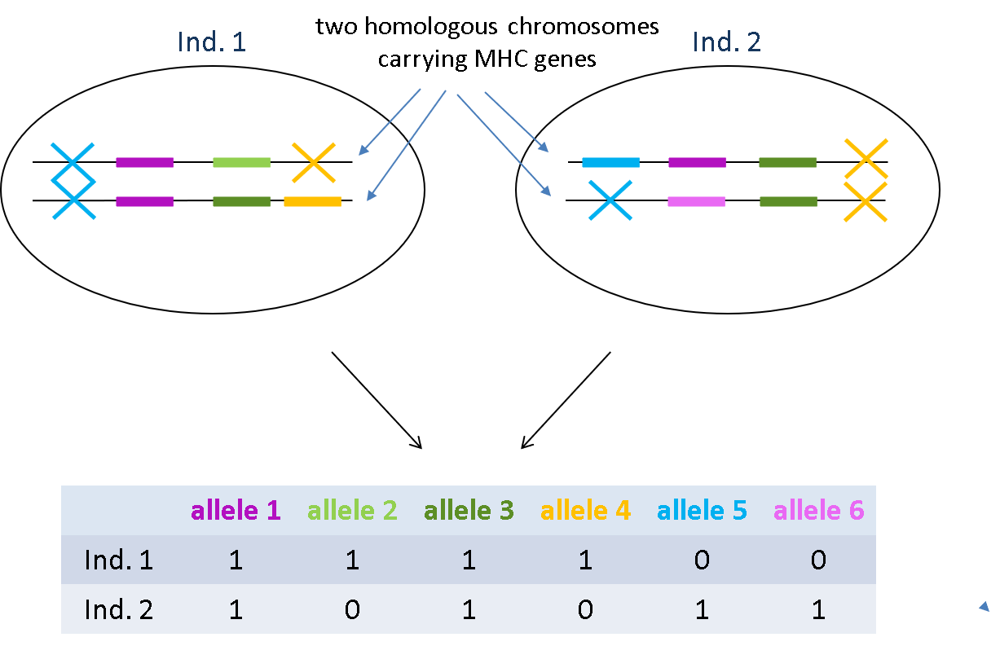

```{r setup, include=FALSE}
knitr::opts_chunk$set(echo = FALSE)
```

## Step by step instructions

In this  class we'll illustrate the practical use of `dplyr` with a real life example. Our task will be to summarize data on MHC class I genotypes from many populations of  several *Triturus* newt species. These genes are duplicated (with different number of genes in different individuals) and highly polymorphic, so each individual has several alleles, and the total number of alleles in a species go into hundreds.  
The picture below explains how the situation seen in the genome translates into the data we have.


We will calculate:

* For each population:
  * number of analysed individuals (`n_ind`)
  * total number of MHC alleles (`n_all`)
  * mean number of MHC alleles per individual (`mean_n_all_ind`)
* For each species you will calculate the same three summaries and additionally also:
  * number of sampled populations (`n_pop`)
  
We'll use the names indicated above as column names of your final result data frame.

* **Download data**  
[Here](https://www.dropbox.com/sh/6s60oyt4snc8fgj/AAAyR9wv3t9hWUah2bq_aNtwa?dl) is the folder with the data we will use. Please download the files to your computer. All files are encoded in UTF-8. Have a look at the content of the files in Notepad++:
    * `genotypes.txt` - tab-delimited file, 1st row contains column names, the remaining rows contain individual IDs and genotypes encoded as presence (`1`) or absence (`0`) of each allele. Allele names are provided in the 1st row.
    * `ID_locality_species.txt`- tab-delimited file containing individual IDs (as in `genotypes.txt` but more), locality name, and species designation. There is also an additional column `transctiptome` that we will not use. Note that locality names contain characters outside the standard Latin character set.
    * `localities.txt`- tab-delimited file containing various information about localities. We'll need only a subset of localities and a subset of columns.
    
    Organisation of these data into the three files emphasizes the concepts we learned during this course:
    * genotype file contains only information about individual IDs and genotypes.
    * further information about each individual is contained in another file, and can be linked with genotypes when needed using the column `ID` which is shared between the files.
    * another file contains information about localities, which can be linked with information about individuals using the shared `locality` column.
    * `ID_locality_species.txt` and `localities.txt` contain more rows and columns than needed. This is not a problem, because we will extract only the information we need from these files.


* **Set up new project in RStudio**  
Within the project folder create new directory named `data`. Copy the three previously downloaded files to `data`

* **Create new R script**  
Make sure it's in you project folder (NOT in `data`). In this script you'll save all the commands we'll use below.

* **Load `tidyverse`**  
```{r, echo = TRUE, message = FALSE}
library(tidyverse)
```
  We're loading the entire `tidyverse` collection, because we'll need some functions that are in packages other than `dplyr`

* **Read genotypes**  
```{r, echo = TRUE}
gen <- read.table("data/genotypes.txt", header = TRUE, sep = "\t", encoding = "UTF-8")
head(gen[,1:10])
```
We used several options to modify the default behaviour or `read.table()`:  

  * column names to be taken from the 1st row,
  * columns are separated by tabs
  * text is encoded as UTF-8

* **Check whether any individual IDs are duplicated**
```{r, echo = TRUE}
nrow(gen)
gen %>% select(ID) %>% distinct() %>% nrow()
```
Here we counted the number of rows in the original dataframe and the dataframe containing only unique IDs

* **Filter out missing data**  
The way genotypes were obtained ensures that if information for an individual is missing for any allele, it's actually missing for all. So it's enough to filter out rows that contain `NA` for the first allele. 
```{r, echo = TRUE}
gen_noNA <- gen %>% filter(!is.na(i_0003))
```
Note that we used a dedicated function `is.na()` to identify `NA` values.

* **Read information about each individual's locality and species**  
We'll need only two columns, so we drop `transcriptome` on the way
```{r, echo = TRUE}
ID_info <- read.table("data/ID_locality_species.txt", header = TRUE, sep = "\t", encoding = "UTF-8") %>% 
  select(-transcriptome)
head(ID_info)
```

* **Read information about localities**  
We'll need just the locality name, country and geographic coordinates, so we select only these four columns:
```{r, echo = TRUE}
localities <- read.table("data/localities.txt", header = TRUE, sep = "\t", encoding = "UTF-8") %>% 
  select(locality, country, latitude, longitude)
head(localities)
```

* **Reshape the genotype data into the "long" format**  
In this step we will radically reshape our data, which will simplify further tasks. Instead of having each allele as a separate column, we'll collapse these columns into two: i) allele name, ii) information about presence (`1`) or absence (`0`) in a given individual.  
So, we take our data frame that looks like this:
```{r, echo = TRUE}
head(gen[,1:20], n = 20)
```
And reshape it using the following command:
```{r, echo = TRUE, warning = FALSE}
gen_long <- gen_noNA %>% pivot_longer(-ID, names_to = "allele", values_to = "present_absent")
head(gen_long, n = 20)
```
We called `pivot_longer()`, informing the function that we want to reshape all the columns except `ID`, that names of the columns should go the new `allele` column, and that values from these columns should go to the `present_absent` column.
Let's compare the number of rows in the original and reshaped data frame:
```{r, echo = TRUE}
nrow(gen_noNA)
nrow(gen_long)
```
In the long format, the information that an individual doesn't have a particular allele is not really useful, so we can just get rid of the rows with (`0`) in `present_absent`. Then, `present_absent` column would not be informative anymore, so we can drop it:
```{r, echo = TRUE}
gen_long <- gen_long %>% filter(present_absent == 1) %>% select(-present_absent)
nrow(gen_long)
```
It's much shorter now!

* **Add information about populations and species to the genotype table**  
We start be adding information about locality and species:
```{r, echo = TRUE, warning = FALSE}
gen_long <- gen_long %>% left_join(ID_info, by = "ID")
head(gen_long, n = 15)
```
Here we used `left_join()` to add columns from `ID_info` data frame to `gen_long` data frame. Left join means that in the resulting data frame all rows from the left (i.e., `gen_long`) data frame will be retained, and only these rows from `ID_info` data frame will be added, which match a value of `ID` column in any row of `gen_long` data frame. If multiple rows from `ID_info` match a single row of `gene_long`, the resulting data frame will have more rows than `gen_long`.

And now we'll add information about localities:
```{r, echo = TRUE, warning = FALSE}
gen_long <- gen_long %>% left_join(localities, by = "locality")
head(gen_long, n = 15)
```

* **Calculate summaries we want**  
First, we calculate for each population: 
    * sample size
    * the number of distinct alleles
    * mean number of alleles per individual
```{r, echo = TRUE, warning=FALSE, message=FALSE}
pop_sum <- gen_long %>% group_by(locality, species) %>% summarise(n_ind = n_distinct(ID),
                                                                  n_all = n_distinct(allele),
                                                                  mean_n_all_ind = n()/n_ind)
head(pop_sum)
```
`n_distinct()` calculates the number of different values in a data frame column **within each group**, as defined in `group_by()`  
`n()` counts the number of rows in each group.  
Please stop here to make sure that you understand what and how was calculated here.

In principle, it's possible that more than one species occurs in a locality, let's check it!

```{r, echo = TRUE}
nrow(pop_sum)
pop_sum %>% distinct(locality) %>% nrow()
```


Then, we calculate the same statistics, but with data grouped by species:
```{r, echo = TRUE, warning = FALSE, message=FALSE}
spec_sum <- gen_long %>% group_by(species) %>% summarise(n_ind = n_distinct(ID),
                                                         n_all = n_distinct(allele),
                                                         mean_n_all_ind = n()/n_ind,
                                                         n_pop = n_distinct(locality))
head(spec_sum)
```

We're done now! But, perhaps, you'd like to have a single table with all your summaries, so that the species summary is below the list of populations of each species for the ease of inspection.

* **Combine the two result data frames into one**

```{r, echo = TRUE, warning = FALSE}
sum_sum <- pop_sum %>% bind_rows(spec_sum) 
sum_sum
```
`bind_rows()` added rows from `spec_sum` to the end of `pop_sum`. Because the data frames differed in the number of columns, i.e., `n_pop` was missing from `pop_sum` and `locality` was missing from `spec_sum`, the columns from both data frames were combined and filled with `NA` where needed.  
Have a look at the entire data frame in RStudio viewer (`View()`).

Now, we'll make use of the fact that `NA` values are put at the end of a column sorted with `arrange()`, to place summary for each species under the summaries of its populations:
```{r, echo = TRUE, warning = FALSE}
sum_sum <- sum_sum %>% arrange(species, locality)
sum_sum
```

And finally, we'd like to replace `NA` in the `Locality` column with the word "Overall"
```{r, warning = FALSE}
sum_sum <- sum_sum %>% 
  mutate(locality = ifelse(is.na(locality), "Overall", locality))
sum_sum
```

`ifelse()` is a function that operates on each row of the data frame, so it's useful together with mutate. If the logical condition is met, i.e., if there is `NA` in the `loaclity` column of a given row, the value of the new column `locality` in this row will be `"Overall"`, otherwise, the value will just be taken from the existing `locality` column.

* **Save the resulting table into a text file**  
We want tab-delimited text file without enclosing any values in quotes
```{r, eval = FALSE}
write.table(sum_sum, "MHC_summary.txt", quote = FALSE, sep = "\t")
```
The same can be done by using `dplyr` function `write_tsv()` called with default options:
```{r, eval = FALSE}
write_tsv(sum_sum, "MHC_summary.txt")
```

## Puting the code together  
Let's see now how much code was actually needed to accomplish our task. Below is the code streamlined a little bit by a more extensive use of `%>%` and skipping commands that print intermediate results. Copy this code to your script and write comments (comment lines start with `#`) explaining what particular commands do.

```{r, echo = TRUE, eval = FALSE}
library(tidyverse)

gen <- read.table("data/genotypes.txt", header = TRUE, sep = "\t", encoding = "UTF-8")

nrow(gen)
gen %>% select(ID) %>% distinct() %>% nrow()

gen_noNA <- gen %>% filter(!is.na(i_0003))

ID_info <- read.table("data/ID_locality_species.txt", header = TRUE, sep = "\t", encoding = "UTF-8") %>% select(-transcriptome)

localities <- read.table("data/localities.txt", header = TRUE, sep = "\t", encoding = "UTF-8") %>% 
  select(locality, country, latitude, longitude)

gen_long <- gen_noNA %>% pivot_longer(-ID, names_to = "allele", values_to = "present_absent") %>% 
  filter(present_absent == 1) %>% select(-present_absent)

gen_long <- gen_long %>% left_join(ID_info, by = "ID") %>% 
  left_join(localities, by = "locality")

pop_sum <- gen_long %>% group_by(locality, species) %>% summarise(n_ind = n_distinct(ID),
                                                                  n_all = n_distinct(allele),
                                                                  mean_n_all_ind = n()/n_ind)
                                                
spec_sum <- gen_long %>% group_by(species) %>% summarise(n_ind = n_distinct(ID),
                                                         n_all = n_distinct(allele),
                                                         mean_n_all_ind = n()/n_ind,
                                                         n_pop = n_distinct(locality))

sum_sum <- pop_sum %>% bind_rows(spec_sum) %>% arrange(species, locality) %>% 
  mutate(locality = ifelse(is.na(locality), "Overall", locality))

write_tsv(sum_sum, "MHC_summary.txt")
```

